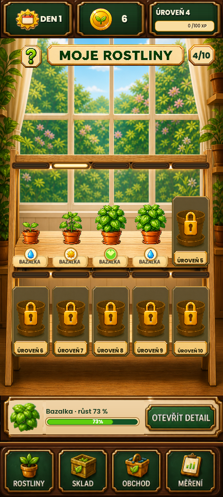
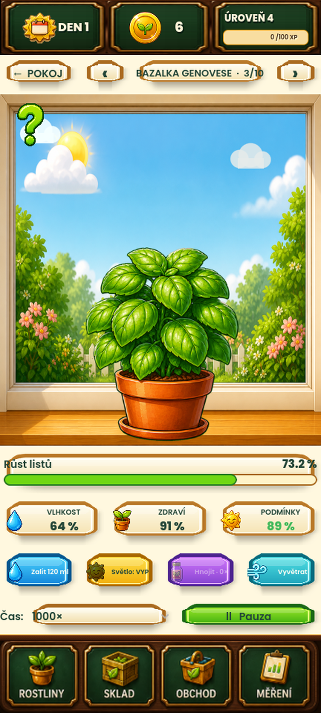

# Bazal’s Pocket Garden

Hratelné MVP mobilního pěstitelského simulátoru pro Android. Projekt používá Godot 4.7 a GDScript, responzivní portrétní výstup přes celý displej a bezpečné základní rozvržení 432 × 960. Vizuální identita používá lesklý stylizovaný 2D mobile-game vzhled s výraznými barvami a čistými siluetami.




## Co je hotové

- jedenáct samostatných druhů: bazalka Genovese, máta peprná, rozmarýn lékařský, dobromysl obecná, Epic levandule úzkolistá, pažitka pobřežní, Rare majoránka zahradní, petržel zahradní, meduňka lékařská, Rare šalvěj lékařská a tymián obecný;
- plynulý růst a základní animace listů, zálivky a odměn;
- zálivka, hnojení, světlo, větrání a aktivní ošetření nemocné rostliny ochranným postřikem;
- pevné reálné cykly 5 hodin pro mátu, 6 hodin pro bazalku, 8 hodin pro pažitku při ideální vláze, 8 hodin pro meduňku, 9 hodin pro petržel, 10 hodin pro majoránku, 11 hodin pro tymián, 12 hodin pro oregano, 14 hodin pro rozmarýn, 18 hodin pro levanduli a 20 hodin pro šalvěj; hráčská pauza ani násobič rychlosti už nejsou součástí hry;
- ikony a stavové texty jsou uzamčené uvnitř společných akčních komponent;
- vlhkost půdy, zdraví, teplota, vlhkost vzduchu, pH, EC, lux, CO₂, O₂ a biomasa;
- fotosyntéza ve světle a dýchání ve dne i v noci;
- poškození suchem, přemokřením, přehnojením, nedostatkem světla a rizikem plísně;
- možnost rostlinu vhodnou péčí stabilizovat;
- sklizeň, sušení, zabalení, proměnlivá tržní cena a prodej;
- tři rotující druhové zakázky s požadavky na bylinu, hmotnost a kvalitu, mincemi, XP a dvěma denními výměnami;
- XP, mince, obecný inventář semen podle ID druhu, nákup semene a hnojiva;
- místní ukládání a nejvýše tři dny offline postupu;
- graf vztahu světla, výměny plynů a biomasy;
- pěstitelská místnost s deseti samostatnými pozicemi a přímým detailem každé rostliny;
- pěstitelská informační karta s odbornými zdroji;
- dotyková navigace a globální vodorovný swipe mezi čtyřmi obrazovkami s uzamčením osy nad svislými seznamy, cílovým leskem záložky a modro-zlatým efektem ve směru prstu;
- devítikrokový vedený první cyklus s Profesorem Bazalem a jednorázovou odměnou;
- tři navazující příběhové kapitoly Profesora Bazala s pěti dlouhodobými cíli, atomickými odměnami a uloženým stavem přečtení;
- po dokončení všech tří kapitol samostatný opakovatelný `Profesorův týdenní protokol` se třemi deterministicky rotujícími variantami, pěti cíli, výslovným přijetím a stavem, který přes konec týdne neexpiruje;
- společná neblokující vrstva efektů a krátké přechody mezi obrazovkami;
- uložitelná volba „Méně pohybu“ pro klidnější mobilní prezentaci;
- teplá procedurální hudba, osm herních zvuků, mobilní vibrace a samostatné nastavení hlasitostí;
- bezpečná migrace starších save podle skutečného stádia rostliny;
- férové vadnutí a úhyn až po nepřetržitém kritickém zanedbání, ruční záchrana po odstranění příčiny a čerstvost zralé sklizně bez zpětného trestání starších save;
- jeden globální den a počasí pro celý pokoj, uložená předpověď a kontextové denní výzvy včetně přípravy na zítřek;
- herbář pro všech jedenáct druhů, pravdivý počet objevených rostlin, pět kanonických rarit a pět mistrovských hodností;
- čtyři čistě kosmetické vzhledy pokoje bez herní výhody; čtvrtá `Badatelská pracovna` se odemyká po šesti dokončených Profesorových protokolech a stojí 360 mincí;
- sbírkový hráčský pokoj jako dobrovolný coin sink: dvanáct neumírajících pokojovek na čtyřech policích po třech, šest pevných dekorací a prázdná vitrína připravená na budoucí úspěchy, vše bez herních bonusů;
- ochrana poškozeného či novějšího save, bezpečné zotavení ze zálohy a návratový souhrn po probuzení aplikace;
- přenositelná `.htgbackup` záloha přes systémový správce souborů s kontrolou integrity, náhledem a potvrzením před obnovou.
- pět trvalých pomůcek celé dílny ve třech úrovních s nákupem u pana Kořínka: konev, lampa, ventilátor, ochranný postřik a sada květináčů;
- mobilní Cesta pěstitele dostupná klepnutím na XP kartu: deset úrovní propojuje odemykání květináčů, vybavení a jednorázové balíčky mincí, semen a hnojiva;
- společné Centrum péče pro deset květináčů s odhadem další kontroly, připomínkami ve hře a dobrovolným lokálním Android upozorněním při zavřené aplikaci;
- první architektonický řez fáze 19: katalog rostlin, swipe navigace a tabule zakázek jsou samostatné služby/komponenty, zatímco `main.gd` zachová kompatibilní vstupy pro testy a validační capture.
- fáze 20 odděluje přesnou prezentaci druhů a stavovou projekci skladové pipeline; herní akce, save a efekty zůstávají koordinované na jediném bezpečném místě.
- fáze 73–75 převádějí hru na návratové reálné tempo, zavádějí save schema 20 a propojují pozdní sklizeň, vadnutí, úhyn, záchranu a vyčištění květináče s detailem, pokojem, Skladem, Centrem péče, oznámením i návratovým souhrnem.
- fáze 76 zavádí jednotné `common / rare / epic / legendary / special`, barevný textový štítek s jednou až pěti hvězdami a pravdivou sbírku, která se ihned rozšíří získáním nového semínka; rarity sama tajně nemění ekonomiku ani životní cyklus.
- fáze 77 zavádí save schema 21 a jediný škálovatelný inventář semen: staré čtyři čítače se bezpečně normalizují do rozsahu 0–9 999 bez dvojího započtení, neznámé ID už nikdy nečte ani nemění bazalku a budoucí druh lze připojit bez další změny formátu save.
- fáze 78 zavádí save schema 22 a férové Botanické balíčky s jedním semínkem: výsledek se deterministicky uzavře už při získání, uloží se do fronty nejvýše 32 balíčků a otevřením jej nelze přetočit; první balíček dává dokončení vedené cesty a další nejvýše jednou denně vyzvednutá výzva.
- fáze 79 dává každému současnému druhu explicitní botanickou vlastnost bez skrytého bonusu rarity: bazalka lépe snáší stres, máta se jednorázově zotaví po správné zálivce, oregano pomaleji nabírá tlak choroby a rozmarýn šetří vodu pouze mimo přemokření.
- fáze 80 zavádí auditovatelný manifest rostlin, profilově řízené textury, dynamický obchod, katalogový export a postupový audit `12 × počet druhů`; chybějící profil už nikdy nepřebírá grafiku bazalky.
- fáze 81 přidává první skutečnou Epic rostlinu: levanduli úzkolistou se šestistavovou grafickou rodinou, 18hodinovým cyklem, odemčením na úrovni 5, vzácnou zásobou u Kořínka, vlastní zakázkou a podmíněným `VOŇAVÝM KVĚTEM`.
- fáze 82 zviditelňuje skutečně aktivní botanickou vlastnost přímo v detailu rostliny: odznak `VLASTNOST AKTIVNÍ` a jemné kódově kreslené halo se zobrazí pouze během platné aktivace; kvalifikovaná zálivka máty navíc oznámí právě jedno `MÁTOVÉ VZPRUŽENÍ` se skutečně obnoveným zdravím.
- fáze 83 přidává Common pažitku pobřežní s vlastní šestistavovou grafikou, obchodem od úrovně 2, zakázkou po objevení a bezstavovou vlastností `SÍLA TRSU`: profilový základ 8 h 48 min se při ideální vláze násobí 1,10× a hráči pravdivě dává přesně osmihodinový cyklus.
- fáze 84 přidává Rare majoránku zahradní s desetihodinovým růstem, vlastní šestistavovou grafikou, obchodem od úrovně 3, zakázkou po objevení a vlastností `VŮNĚ PO USUŠENÍ`: sklizeň s kvalitou alespoň 80 % se suší o 20 % rychleji, tedy 2 h 24 min místo 3 hodin.
- fáze 85 přidává Common petržel zahradní s devítihodinovým růstem, dvouhodinovým sušením, vlastní šestistavovou grafikou, obchodem od úrovně 2 a vlastností `TOLERANCE POLOSTÍNU`: ve dne pod 5 400 lux zvedne pouze světelnou část kondice nejméně na 60 %, nikdy ne v noci.
- fáze 86 přidává Common meduňku lékařskou s osmihodinovým růstem, dvouhodinovým sušením, vlastní šestistavovou grafikou, obchodem od úrovně 3 a vlastností `BOHATÝ SAMOVÝSEV`: po prodeji má 75% deterministickou šanci vrátit semínko místo základních 58 %.
- fáze 93 zavádí save schema 23 a první navazující kapitolu `lost_herbarium_pages`: po dokončení vedené cesty sleduje návrat k dozrání či dosušení, kvalitní sklizně různých druhů, druhovou zakázku, objevování Herbáře a denní výzvy ve dvou rostoucích UTC dnech; odměna je atomických 75 mincí, 60 XP, jeden zapečetěný Botanický balíček a jedna Profesorova pečeť.
- fáze 94 balí současný zdrojový kontrakt schema 23 do immutable interního Android kandidáta `0.44.0-rc28` / code 45; automatická technická část včetně fyzické instalace a migrace prošla na 100 %, zatímco ruční mobilní kontrola a veřejné publikování zůstávají otevřené.
- fáze 95 včetně korekce rarity je hotová v hlavním projektu na 100 %: přidává desátý druh `salvia_officinalis` jako Rare / `VZÁCNÁ` / ★★ rostlinu s vlastností `STŘÍDMÁ VÝŽIVA`, druhou kapitolu `silver_sage_legacy` a hlavní save schema 24. Současný katalog nemá žádný Legendary profil. Nevytváří nový APK ani telefonní důkaz; RC28/schema 23 zůstává historicky immutable.
- fáze 96 je hotová v hlavním projektu na 100 %: rozšiřuje nabídku o tři kanonické dvoudruhové směsi `evening_freshness`, `soup_pair` a `aromatic_sachet`, které automaticky a deterministicky vyberou přesně dva vyhovující balíčky. Hlavní save schema 25 bezpečně migruje staré jednodruhové zakázky, přijímá pouze známé směsi a chrání aktivní rotaci před hostile sekvencemi a duplicitami. Nevytváří nový APK ani telefonní důkaz; RC28/code 45/schema 23 zůstává historicky immutable.
- fáze 97 je hotová v hlavním projektu na 100 %: po druhé pečeti otevírá třetí kapitolu `grand_herbarium_exhibition` / `Velká herbářová výstava`, rozšiřuje Pěstitelský deník na devět odznaků a zavádí titul `MISTR HERBÁŘE`. Hlavní save schema 26 drží oddělené story trust boundary 23/24/26. Nevytváří nový APK ani telefonní důkaz; RC28/code 45/schema 23 zůstává historicky immutable.
- fáze 98 je hotová v hlavním projektu na 100 %: po autoritativním vyzvednutí třetí kapitoly nabízí samostatný opakovatelný `professor_weekly_protocol` / `Profesorův týdenní protokol`, ukládá jeho průběh v hlavním schema 27 a po čtyřech dokončeních přidává desátý odznak `VÝZKUMNÝ PARTNER`. Nevytváří nový APK ani telefonní důkaz; RC28/code 45/schema 23 zůstává historicky immutable.
- fáze 99 je hotová v hlavním projektu na 100 %: hlavní schema 28 rozšiřuje týdenní výzkum o tři deterministické protokoly `balanced_v1`, `quality_focus_v1` a `processing_focus_v1`; varianta se při přijetí uzamkne. Po šesti dokončeních zpřístupní čtvrtý vzhled `research_study` / `Badatelská pracovna` za 360 mincí, bez herního bonusu. Odznak `room_collector` zůstává navázaný pouze na tři původní vzhledy. Fáze nevytváří nový APK ani telefonní důkaz; RC28/code 45/schema 23 zůstává historicky immutable.
- fáze 100 / RC29 balí celý současný obsah včetně fáze 99 do immutable interního Android kandidáta `0.45.0-rc29` / code 46 se zdrojovým i save schema 28. Automatická release sada, podpis, payload, pětiminutová instalace a technická migrace schema 23 → 28 prošly; 18bodová ruční mobilní brána a veřejné publikování zůstávají otevřené.
- fáze 101 je hotová v hlavním projektu na 100 %: přidává denní výzvu `rescue`, která dá zvadlé rostlině přednost a odmění až skutečnou záchranu po odstranění kritické příčiny a poškozených listů. Save schema 28, ekonomika, grafika i RC29 zůstávají beze změny; nový Android artefakt nevznikl.
- fáze 102 je hotová v hlavním projektu: přidává Common tymián obecný se šestistavovou grafikou, odemčením na úrovni 4, jedenáctihodinovým růstem, vlastní jednodruhovou zakázkou a směsí s rozmarýnem. Vlastnost `SUCHOMILNÝ RYTMUS` zrychluje růst na 1,12× výhradně při vláze 28–43 % včetně hranic; save schema 28 i immutable RC29 zůstávají beze změny a nový Android artefakt nevznikl.
- fáze 103 je dokončená: stojan se šipkami, samostatný hráčský pokoj a neaktivní náhled skleníku prošly 1 241 funkčními kontrolami, responzivní maticí 7/7, fyzickým technickým auditem Xiaomi / Android 13 a ručním výsledkem `VŠE OK`. Přesný rozsah a důkazy popisuje [audit fáze 103](docs/PHASE103_HOME_LOCATIONS.md).
- fáze 104 je dokončená a fyzicky přijatá na RC31: šest dekorací lze za stávající mince koupit jednou, zdarma přesouvat mezi pěti místy a odstranit bez refundace. Jde výhradně o vizuální obsah bez herních bonusů. Save schema 29 chrání vlastnictví a unikátní rozmístění, zatímco schema 28 nemůže nové placené položky podvrhnout. Opravený svislý tah, nákup knih a monstery, přesuny, odstranění i persistence po restartu prošly na Xiaomi / Android 13; 1 254 funkčních kontrol, responzivní, obrazové a Android důkazy shrnuje [audit fáze 104](docs/PHASE104_ROOM_DECORATIONS.md).
- fáze 105 je funkčně dokončená: skleník má čtyři nezávislé záhony, cherry rajče za 10 mincí, bezplatnou zálivku, šestihodinový online/offline růst a sklizeň za 24 mincí + 8 XP. Save schema 30 chrání nový stav před podvržením ze schema 29. Android 16 emulátor odhalil a ověřil opravu systémového Zpět. Neměnný ARM64 kandidát `0.47.0-rc33` / code 50 byl nainstalován na Xiaomi, prošel shodou APK, zachováním save, 60sekundovým foreground během a nulovým počtem fatálních nálezů. Ruční gesto Zpět a skutečné doručení upozornění zůstávají k potvrzení. Podrobnosti jsou v [auditu fáze 105](docs/PHASE105_FUNCTIONAL_GREENHOUSE.md).
- fáze 106 je dokončená a zabalená v RC34: prázdný záhon nabízí dvě samostatné 64px volby, cherry rajče a sladkou papriku. Paprika stojí 14 mincí, roste osm hodin a sklizeň dává 34 mincí + 11 XP. Save schema 31 povoluje obě známé plodiny, zatímco schema 30 přijme jen původní rajče a odmítne podvrženou papriku. Opravené `ROSTLINY` po cestě ze skleníku přes Sklad vždy otevře stojan. Immutable `0.48.0-rc34` / code 51 prošel 1 278 kontrolami, kompletní release bránou a fyzickou instalací na Xiaomi s migrací save 30 → 31. Přesný kontrakt je v [auditu fáze 106](docs/PHASE106_GREENHOUSE_CROP_CHOICE.md).
- fáze 107 je dokončená a zabalená v RC35: skleník má tři čitelné 64px volby, úrovňové zámky a novou salátovou okurku. Rajče je dostupné od úrovně 1, paprika od úrovně 2 a okurka od úrovně 4; zamčenou plodinu odmítne i doménová vrstva bez odečtení mincí. Save schema 32 autorizuje okurku, zatímco schema 31 zachová rajče a papriku, ale podvrženou okurku odmítne. Immutable `0.49.0-rc35` / code 52 prošel 1 286 kontrolami, kompletní release bránou a technickým auditem na Xiaomi se zachováním hráčského save. Přesný kontrakt je v [auditu fáze 107](docs/PHASE107_GREENHOUSE_PROGRESSION.md).
- fáze 108 stabilizuje RC35 bez změny hry, ekonomiky nebo save: testovací runner nyní vyžaduje současně úspěšný marker i exit code 0, release runner bezpečně připraví, hashově ověří a teprve potom synchronizuje přepisovatelný Android alias, debug preset má explicitní minSdk 24 / targetSdk 36 a tomato E2E používá skutečně viditelné tlačítko plodiny. RC35/code 52/schema 32 i jeho immutable APK zůstaly beze změny; sada narostla na 1 289 kontrol. Rozsah a nové důkazy shrnuje [stabilizace fáze 108](docs/PHASE108_RC35_STABILIZATION.md).
- fáze 109 je dokončená: skleník na 360×800 už nepřekrývá spodní záhony stavovým panelem, tlačítko skleníku ukazuje odvozený počet čekajících zálivek a sklizní a offline dozrání přidá jednorázový řádek do návratového souhrnu. Save schema 32, katalog, ekonomika i odměny zůstávají beze změny. Původní source-only průchod měl 1 299 kontrol; navazující immutable RC36 `0.50.0-rc36` / code 53 tuto runtime změnu zabalil a prošel technickým auditem na Xiaomi bez ztráty save. Podrobnosti jsou v [auditu fáze 109](docs/PHASE109_GREENHOUSE_RETURN.md).
- fáze 110 zavádí jediný autonomní runner pro krátkou regresi, úplný pracovní průchod, nový immutable release a volitelný navazující technický audit telefonu. Každý krok vyžaduje současně exit code 0 i své PASS markery, ukládá jednotný JSON/Markdown report a nikdy nepoužívá obecný APK alias ani nemaže data aplikace. První skutečný `Quick` i výchozí `Full` průchod prošly; sada má 1 308 kontrol a všech pět plných kroků je `PASSED`. Neautomatizovatelné hardwarové a systémové důkazy zůstávají sloučené do jediného závěrečného lidského checklistu. Podrobnosti jsou v [automatizaci fáze 110](docs/PHASE110_AUTOMATED_WORKFLOW.md).
- fáze 111 uzavírá ověřené zdrojové změny fází 103–110 do jediného dohledatelného Git baseline a tagu `v0.50.0-rc36`. Před snapshotem kontroluje dirty strom, tajemství, ignorované build artefakty, immutable APK i úplný automatizovaný průchod. Runtime, ekonomika, save schema 32 a RC36 se nemění. Podrobnosti jsou ve [zdrojovém baseline fáze 111](docs/PHASE111_SOURCE_BASELINE.md).
- fáze 112 dokončuje celé lokální přijetí RC36 na Xiaomi / Android 13: skutečný dotyk, systémové Zpět a tahy, export/import `.htgbackup`, bezpečná nová hra a návrat, oprávnění i oznámení prošly jedním lidským průchodem. Readback potvrdil přesný hash RC36, save 32 → 32, 11/11 foreground vzorků a 0 fatálních nálezů. Běžná připomínka přežila skutečný reboot bez otevření hry a závěrečný přirozený návrat po 8 h 47 min. ukázal `PŘIPRAVENO KE SKLIZNI` pro všechny čtyři skleníkové záhony. `PHASE112_LONG_DELAY_GATE=PASSED`; publikování je na přání uživatele mimo rozsah. Podrobnosti jsou v [lokálním mobilním přijetí fáze 112](docs/PHASE112_LOCAL_MOBILE_ACCEPTANCE.md).
- fáze 113 přidává čtvrtou skleníkovou plodinu `Ředkvička zahradní` pro úroveň 3. Stojí 12 mincí, po zálivce roste čtyři hodiny a sklizeň dává 22 mincí + 9 XP. Save schema 33 ji autorizuje odděleně, zatímco schema 32 zachová dřívější tři plodiny, ale podvrženou ředkvičku odmítne. Čtyři volby prošly regresí 1 317/1 317, úplnou validací, autonomním Full průchodem i responzivní maticí 8/8; grafika ředkvičky je kreslená kódem a zdrojové PNG ani schválené reference se nezměnily. Nový immutable RC37 `0.51.0-rc37` / code 54 je připravený, ale kvůli dobíhajícímu přirozenému RC36 testu se zatím neinstaluje. Podrobnosti jsou v [auditu fáze 113](docs/PHASE113_GREENHOUSE_RADISH.md).
- fáze 114 sjednocuje automatizaci s vědomě odloženým publikováním. Quick, Full i release reporty bez přepínače pravdivě vracejí `OUT_OF_SCOPE_BY_USER`; pouze explicitní `-PublishingRequested` obnoví checklist klíče/AAB/store jako `PENDING`. Přepínač sám nic nepublikuje. Obě větve prošly 1 321 kontrolami; runtime, schema 33, RC37 i telefon zůstaly beze změny. Podrobnosti jsou v [auditu fáze 114](docs/PHASE114_PUBLISHING_SCOPE.md).
- fáze 115 rozšiřuje skleník o pátou plodinu `Lilek vejcoplodý` pro úroveň 5. Výsadba stojí 22 mincí, po zálivce roste dvanáct hodin a sklizeň dává 60 mincí + 18 XP. Save schema 34 chrání placený stav lilku před podvržením ze schema 33 a doména znovu atomicky kontroluje úroveň i cenu. Pět samostatných voleb se na kompaktním obsahu vejde jako cíle 64×64 px, grafika lilku je kreslená kódem a zdrojové PNG ani schválené reference se nezměnily. Regrese 1 330/1 330, úplný Full průchod i nový immutable RC38 prošly; RC38 se kvůli dobíhajícímu přirozenému RC36 testu zatím neinstaluje. Podrobnosti jsou v [auditu fáze 115](docs/PHASE115_GREENHOUSE_EGGPLANT.md).
- fáze 116 přidává jednu trvalou skleníkovou zakázku bez denního timeoutu. Odpovídající sklizeň postupuje kanonický cíl plodiny a po jeho dosažení atomicky připíše bonus; jiná plodina dál dává běžnou odměnu bez falešného postupu. Rotace respektuje odemčené úrovně 1–5, save schema 35 odmítá podvržený postup i odměny a kompaktní 360×800 UI zůstává čitelné bez nového modalu. Regrese 1 342/1 342, validation, Full i immutable RC39 prošly; telefon zůstává kvůli přirozenému RC36 long-delay důkazu nedotčený. Podrobnosti jsou v [auditu fáze 116](docs/PHASE116_GREENHOUSE_ORDERS.md).
- fáze 117 přidává prémiovou variantu skleníkové zakázky `ZAKÁZKA+`: dvě odpovídající sklizně musí pocházet ze dvou různých záhonů. Opakovaná sklizeň stejného záhonu dál dává běžnou odměnu, ale zakázku neposune. Save schema 36 autorizuje variantu, deduplikuje indexy záhonů a kanonizuje vyšší bonus +8 mincí a +4 XP. Regrese 1 351/1 351, validation, Full i immutable RC40 prošly; nový APK se do telefonu neinstaloval. Podrobnosti jsou v [auditu fáze 117](docs/PHASE117_GREENHOUSE_QUALITY_ORDERS.md).
- fáze 118 přidává reputaci skleníku založenou výhradně na počtu dokončených skleníkových zakázek. Milníky 3/8/15 odemykají tituly `SPOLEHLIVÝ PĚSTITEL`, `DODAVATEL TRHU` a `MISTR SKLENÍKU`; první dva dávají jednorázově 40 mincí + 20 XP a 80 mincí + 40 XP, poslední jen kosmetickou ceduli. Save schema 37 odvozuje tier z autoritativního počtu, takže migrace ani podvržený save nevytvoří zpětné odměny. Regrese 1 360/1 360, validation, Full i immutable RC41 prošly; telefon ani publikování nebyly vyžádány. Podrobnosti jsou v [auditu fáze 118](docs/PHASE118_GREENHOUSE_REPUTATION.md).
- fáze 119 převádí původní omezený swipe na čtyřobrazovkovou mobilní navigaci z libovolného místa hlavní záložky. Osa se po 18 px uzamkne, 90px vodorovný tah přepne bez wrapu, svislý tah zůstane seznamu a detail rostliny, skleník, pokoj i blokující dialogy si zachovají vlastní ovládání. Modro-zlatý pás a lesk cílové záložky sledují fyzický směr prstu, zatímco klepnutí zůstalo beze změny. Regrese 1 370/1 370, validation, úplný release audit i immutable RC43 prošly; RC42 zůstává nedotčený mezikandidát, telefon ani publikování nebyly vyžádány. Podrobnosti jsou v [auditu fáze 119](docs/PHASE119_GLOBAL_SWIPE_NAVIGATION.md).
- fáze 120 nahrazuje technický náhled skleníku živým originálním prostředím a čtyřmi skutečně vyvýšenými dřevěnými záhony. Po uživatelském připomínkování už nejde o plochou pravidelnou matici: zadní dvojice je menší a ustoupená, přední širší, vyšší a blíž hráči, takže sleduje perspektivu podlahy. Každý záhon má čitelnou zeminu, přední stěnu, nohy, kovové spoje a vlastní stav pro zálivku, růst a sklizeň; původní funkce pěti plodin, zakázek, reputace i save schema 37 se nemění. Regrese 1 374/1 374, úplná obrazová validace, výkon, endurance, progression, responsive 8/8, export, podpis i payload prošly a vzniklo immutable RC45; RC44 zůstává nedotčený snímek před doladěním. Telefonní instalace čeká pouze na opětovné připojení zařízení; publikování zůstává mimo rozsah. Podrobnosti jsou v [auditu fáze 120](docs/PHASE120_RAISED_GREENHOUSE_VISUALS.md).
- fáze 121 opravuje fyzický nález z RC45: vodorovný tah přes nákupní tlačítko už nesmí současně přepnout obrazovku a provést nákup. RC46 tuto ochranu na telefonu potvrdilo, ale následný svislý scroll odhalil stejnou třídu chyby pro rolovatelný katalog. Podrobnosti jsou v [auditu fáze 121](docs/PHASE121_PHYSICAL_SWIPE_TRANSACTION_GUARD.md).
- fáze 122 rozšiřuje ochranu na svislý drag. Scroll zůstává přirozený pro seznam, ale akční tlačítko se během stejného gesta ani při jeho uvolnění nespustí; následující samostatné klepnutí je znovu povolené. Regrese 1 377/1 377, úplná validace, release RC47 i technický audit telefonu prošly. Opakování původně chybného svislého gesta nezměnilo stav ihned ani po 20 sekundách a vodorovný tah přes Pažitku také nic nekoupil. Podrobnosti jsou v [auditu fáze 122](docs/PHASE122_VERTICAL_SCROLL_TRANSACTION_GUARD.md).
- fáze 123 převádí hráčský pokoj do stejného živého vizuálního směru jako stojan a skleník. Osm menších pokojovek se vejde na třípatrový stojan, popínavka vyrůstá z vlastního květináče, knihy, hnojiva, složené květináče, lampička, botanický obraz a plastová konvička mají vlastní místa a šestipoziční vitrína je připravená na budoucí úspěchy. Vše se kupuje za společné mince právě jednou, zdarma přesouvá a nikdy neovlivňuje péči. Save schema 38 bezpečně migruje starých pět míst; regrese 1 378/1 378, úplná validace, výkon, endurance, progression, responsive 8/8, export, podpis i payload prošly a vzniklo immutable RC48. Podrobnosti jsou v [auditu fáze 123](docs/PHASE123_PLAYER_ROOM_COLLECTION.md).
- fáze 124 doplňuje kočičí kout na podlaze s pelíškem a dvěma miskami, samostatnou sadu sklenic se sušenými bylinkami na horní polici a živý výhled s mrakem, ptákem a motýlem. Koutek i sklenice jsou jednorázové kosmetické nákupy za společné mince; skutečný mazlíček a jeho péče jsou pouze bezpečně připravené, ne předstírané. Save schema 39 chrání oba nové placené předměty, zatímco RC48 schema 38 je nemůže podvrhnout. Regrese 1 384/1 384, úplná validace, výkon, endurance, progression, responsive 8/8, export, podpis i payload prošly a vzniklo immutable RC49; telefon ani publikování nebyly vyžádány. Podrobnosti jsou v [auditu fáze 124](docs/PHASE124_PLAYER_ROOM_LIVING_DETAILS.md).
- fáze 125 opravuje sklizené a sušené rostliny na stojanu, odstraňuje duplicitní růstovou kartu a přesouvá zvuk pod samostatné hráčské Nastavení; immutable RC50 prošlo lokální i fyzickou technickou bránou. Podrobnosti jsou v [auditu fáze 125](docs/PHASE125_RACK_CLEANUP_AND_PLAYER_SETTINGS.md).
- fáze 126 sjednocuje portrétní vizuální kameru stojanu, pokoje a skleníku. Nový blízký pokoj používá dominantní čtyřpolicový stojan 2 × 4, vitrínu 3 × 2 a zdrojově ukotvené dekorace; původní PNG zůstalo nedotčené. Regrese 1 394/1 394, úplná validace, výkon, endurance, progression, responsive 9/9, export, podpis i payload prošly a vzniklo immutable RC51. RC51 je nyní nainstalované na telefonu se zachovaným savem a technický device audit prošel; subjektivní vzhled čeká na jeden lidský průchod. Podrobnosti jsou v [auditu fáze 126](docs/PHASE126_GARDEN_VISUAL_CAMERA.md).
- fáze 127 zavádí finální vizuální systém `phase127_final_visual_system_v1`: společné tokeny, šest rodin assetů, tři scénové profily a explicitní rozměr, pivot, vrstvu i bezpečný výřez každého živého pokojového a skleníkového prvku. Pokoj používá 16 nových profilovaných dekorací a skleník profilované vyvýšené záhony, pět plodin, stavové ikony a dřevěné štítky; všech 241 PNG je klasifikováno a žádné není mimo kontrakt. Quick i úplná release validace prošly 1 400/1 400 kontrolami, responsive 9/9, exportem, podpisem a fyzickým Android auditem. Immutable RC53 je nainstalované na Xiaomi se zachovaným savem; RC52 zůstává immutable mezisestavení a zdrojová PNG nebyla přepsána. Podrobnosti jsou v [auditu fáze 127](docs/PHASE127_FINAL_VISUAL_SYSTEM.md).
- fáze 128 je první celoprojektový náhled parity se světlým botanickým stylem. `ROSTLINY` zůstávají výtvarným source of truth; Sklad, Měření a Pokoj dostaly profilované ilustrované prostředí a sdílené povrchové tokeny. Jde o náhled čekající na lidské přijetí, nikoli nový release.
- fáze 129 se výhradně soustředí na Skleník a Pokoj: oba používají kompaktní titulní ceduli, samostatnou řadu lokálních akcí a nepřekrytou hlavní scénu. Obrazovka Rostliny je pouze read-only reference a její runtime ani assety se nemění. Podrobnosti jsou v [náhledu fáze 129](docs/PHASE129_GREENHOUSE_ROOM_FOCUS.md).
- fáze 130 nahrazuje čtyři rozházené skleníkové truhlíky přesně dvěma velkými vyvýšenými pěstebními boxy. Každý box má jednu středovou příčku a dvě samostatné půdní části, takže všech pět plodin, zálivka, růst, sklizeň, zakázky i čtyři funkční indexy záhonů zůstávají beze změny. Nový verzovaný podklad je ukotvený ve stejné perspektivě jako podlaha a vegetace; původní Phase 120 PNG zůstalo hashově nedotčené. Validace prošla 1 414 kontrolami a responzivní matice 9/9. Podrobnosti jsou v [auditu fáze 130](docs/PHASE130_GREENHOUSE_TWO_BOXES.md).
- fáze 131 povyšuje uživatelem vybraný živý botanický obraz na hashovaný master výtvarného směru `phase131_living_botanical_master_v1`. Teplé dřevo, tyrkys, sytá zeleň, čisté komiksové obrysy, sluneční světlo, čitelné materiály a živé okraje jsou závazné pro prostředí, rostliny, dekorace i UI. Quick nyní prochází skripty a katalogy: všech 122 runtime PNG patří do master profilu, celkem je klasifikováno 246 PNG a žádné není bez profilu. Podrobnosti jsou v [kontraktu fáze 131](docs/PHASE131_LIVING_BOTANICAL_MASTER.md).
- fáze 132 převádí schválenou živost Skleníku do Pokoje bez zásahu do Rostlin. Nový verzovaný 887 × 1774 podklad zachovává čtyřpolicový stojan, šest úspěchových míst, osm pevných dekorací a budoucí kočičí kout, ale zesiluje hloubku, světlo, živou zeleň a tyrkysové materiálové akcenty. Všech 1 418 regresních kontrol, úplná vizuální validace i responzivní matice 9/9 prošly; APK ani save schema se nemění. Podrobnosti jsou v [auditu fáze 132](docs/PHASE132_PLAYER_ROOM_LIVING_VISUAL.md).
- fáze 133 mění pouze pokojový stojan na čtyři police po třech skutečných rostlinných slotech. Osm existujících pokojovek je menších, přesně ukotvených a každé prázdné i obsazené místo má samostatnou keramickou podmisku. Save schema 40 bezpečně zachová levé a pravé umístění starých rostlin, vloží čtyři nové středy a posune všech osm pevných dekorací bez ztráty. Immutable RC53, nainstalovaná APK i obrazovka Rostliny zůstávají nedotčené. Podrobnosti jsou v [auditu fáze 133](docs/PHASE133_ROOM_SHELF_PLANTS.md).
- fáze 138 balí schválenou integrovanou sadu pokojovek do immutable RC54 `0.65.0-rc54` / code 71 / schema 40. Úplný release i fyzický technický audit Xiaomi prošly, save migroval 39 → 40 bez ztráty stabilních hodnot a RC54 je nainstalované. Subjektivní vzhled po odemčení telefonu zůstává jedinou lidskou bránou. Podrobnosti jsou v [Android handoffu fáze 138](docs/PHASE138_RC54_ANDROID_HANDOFF.md).
- fáze 143 nahrazuje aktivní kresbu stojanu uživatelem schválenou jednotnou sadou 12 pokojovek. Zdroj i skutečný Godot render jsou `APPROVED_BY_USER`; všechny sestavy zachovávají společnou velikost keramiky, podmisek, baseline a stínování. Podrobnosti jsou v [dokumentu fáze 143](docs/PHASE143_USER_APPROVED_UNIFORM_RACK_SET.md).
- fáze 144 balí schválený Phase 143 render do nového immutable RC55 `0.66.0-rc55` / code 72 / schema 41. Úplný lokální release, podpis, payload, 1 467 regresních kontrol, výkon, endurance, progression i responsive 9/9 prošly. RC55 je připravené, ale zatím není nainstalované ani publikované. Podrobnosti jsou v [Android kandidátu fáze 144](docs/PHASE144_RC55_ANDROID_CANDIDATE.md).
- fáze 145 pokračuje source-only vrstvami v pravé části Pokoje: vnořené květináče mají kontaktní stín a přední hranu police, kočičí koutek skládá podlahový stín, původní hladký pelíšek a samostatnou dvojici stejně velkých keramických misek na vodu a krmivo. Save schema 41, ekonomika, schválený stojan, Rostliny, skleník i immutable RC55 zůstávají beze změny. Validation prošla 1 472/1 472, responsive 9/9 a vizuální kontrakt eviduje 345 profilovaných / 0 neprofilovaných PNG. Skutečný Godot render čeká na uživatelské posouzení; mobil i APK jsou odložené. Podrobnosti jsou ve [vrstvených detailech fáze 145](docs/PHASE145_LAYERED_ROOM_DETAILS.md).
- fáze 146 přepíná celý Pokoj na uživatelem schválený celoplošný master. Prázdná deska drží architekturu a nábytek, 12 Phase 143 pokojovek zůstává samostatně koupitelných a přesouvatelných a osm pevných dekorací používá reprodukovatelnou transparentní RGBA vrstvu bez obdélníkových výřezů pozadí. Opravená `v3` odděluje všechny předměty, odstraňuje zapečené šedé lemy i překryvy konvičky, pelíšku a misek a kreslí jemný kontaktní stín až v Godotu. Ovládání je seskupené vlevo, takže knihy a bylinkové sklenice zůstávají viditelné. Validation prošla 1 477/1 477, responsive 9/9, visual contract eviduje 353 profilovaných / 0 neprofilovaných PNG a Quick `.godot/automation/20260824-165840Z` skončil `PASSED`. Rostliny, skleník, schema 41 i immutable RC55 jsou beze změny; skutečný Godot render čeká na uživatelské schválení a telefon je nedostupný. Podrobnosti jsou ve [schváleném masteru fáze 146](docs/PHASE146_APPROVED_ROOM_MASTER.md).
- fáze 147 uzamyká uživatelem schválený sytý ručně malovaný 2D cartoon master pro postupné překreslení celé hry. Zachovává současná tlačítka, ikony a navigaci, ale zakazuje pixel art, nalepené výřezy, bílé lemy a runtime atlasy se zapečenou šachovnicí. Podrobnosti jsou ve [výtvarném masteru fáze 147](docs/PHASE147_APPROVED_PAINTED_CARTOON_MASTER.md).
- fáze 148 technicky vytvořila 21 RGBA vrstev bez šachovnice a prošla tehdejší automatizací, ale následný přísný audit skutečného renderu opravil dřívější interní verdikt na `FAILED`: samostatně generované pozadí a atlasy se liší geometrií, světlem, sytostí, měřítkem i kontaktními stíny a nepůsobí jako jedna malba. Technický průchod tak zůstává historickým důkazem extrakce, nikoli schválením vzhledu. Podrobnosti jsou v [dokumentu fáze 148](docs/PHASE148_PAINTED_CARTOON_PLAYER_ROOM.md).
- fáze 149 dokončuje lokální převod Pokoje na přesnou uživatelem určenou obrazovku. Závazný výřez 853 × 1548 používá target-derived clean plate, 20 funkčních nákupních slotů, 21 target-derived objektových vrstev, source-native geometrii a samostatnou přední occlusion vrstvu polic. Ve schváleném pořadí slotů používá bajtově přesný kanonický master; po nákupu, odstranění či přesunu zůstává funkční dynamické vrstvení. Validation prošla 1 490/1 490, responsive 9/9 a gated Godot porovnání s MAE 6,805 / RMSE 12,005. Uživatel 25. 8. 2026 skutečný Godot render výslovně schválil a navazující Quick `.godot/automation/20260825-042058Z` skončil `HOW_TO_GROW_AUTOMATION=PASSED`. Save schema 41, ekonomika a immutable RC55 se nemění; telefon není dostupný a APK nevzniklo. Podrobnosti jsou v [dokumentu fáze 149](docs/PHASE149_EXACT_PLAYER_ROOM_TARGET.md).
- fáze 150 převádí Skleník na schválenou kompozici dvou společných vyvýšených boxů se čtyřmi funkčními záhony. Závazný cíl 864 × 1544 zůstává immutable a report-only; zapečený konkrétní stav se nepoužívá jako falešně dynamické pozadí. Šest runtime plodin používá deterministické alfa-only vrstvy se zachovaným RGB a SHA původních Phase127 maleb, bez oddělených hnědých půdních ostrůvků. Validační stav obsahuje prázdný záhon, šest sazenic ve třech sloupcích, rajče v 50 % růstu a připravený lilek; dvě vizuální krabice, čtyři hitboxy, HUD, navigace, schema 41 i ekonomika zůstávají funkční. Finální validation `.godot/validation/20260825-071114Z` prošla 1 496/1 496, responzivní matice 9/9 a Quick `.godot/automation/20260825-071439Z`. Interní Godot cohesion audit prošel a uživatel 25. 8. 2026 skutečný Godot render výslovně schválil; telefon je nedostupný a APK nevzniklo. Podrobnosti jsou v [dokumentu fáze 150](docs/PHASE150_APPROVED_PAINTED_GREENHOUSE.md).
- fáze 151 převádí Stojan a Detail na schválený malovaný směr bez zapečení herního stavu: 10 slotů, všech 11 druhů × 6 stavů, úrovně, světla, badge, akce a save zůstávají dynamické. Rostliny mají větší policovou přítomnost, společnou baseline a podmisku; zamčené pozice používají samostatný průhledný fialový válec s dynamickým textem úrovně. Zdrojových 66 PNG rostlin zůstalo byte-exact a 68 importů používá mipmapy. Uživatel schválil skutečné Godot rendery; append-only baseline přechod je uzavřený. Finální validace `.godot/validation/20260825-102405Z` prošla `1502/1502`, capture i všemi 18 tvrdými obrazovými případy. Podrobnosti jsou v [dokumentu fáze 151](docs/PHASE151_APPROVED_PAINTED_RACK_AND_DETAIL.md).
- fáze 152 převádí Sklad na schválený živý workshop: malované okno, police, bylinky, sklenice a balíčky jsou skutečná scénová vrstva, zatímco zásoby, cesta úrody, hlavní akce, scroll a zakázky zůstávají plně funkční a dynamické. Skutečný Godot render byl uživatelem schválen a chrání jej samostatná append-only tvrdá baseline. Finální validace `.godot/validation/20260825-102405Z` prošla; responsive 9/9 a Quick `.godot/automation/20260825-095505Z` zůstávají PASS. Telefon je nedostupný a APK nevzniklo. Podrobnosti jsou v [dokumentu fáze 152](docs/PHASE152_APPROVED_PAINTED_STORAGE_TARGET.md).
- fáze 153 převádí schválený náhled Obchodu do dynamické malované obrazovky: větší integrovaný pult pana Kořínka, malovaná cedule a dialogová plaketa, výrazná peněženka, dřevěně ukotvené třísloupcové karty a čtyři velké kategorie. Ceny, zásoby, vzácnost, vyprodání, jedenáct semen, hnojivo, vybavení, nákup, výkup i scroll zůstávají živé; návrhový obrázek není zapečený do runtime. Regrese prošla 1506/1506, responsive `.godot/responsive/20260825-111352Z` 10/10 a finální úplná validace `.godot/validation/20260825-115747Z` prošla všemi 19 tvrdými obrazovými případy. Uživatel skutečný Godot render schválil a chrání jej nový append-only baseline s přesnou shodou 0/0/0; původní koncept zůstává report-only. Závěrečný Quick `.godot/automation/20260825-120031Z` je PASS. Telefon je nedostupný, APK nevzniklo a RC55 zůstává immutable. Podrobnosti jsou v [dokumentu fáze 153](docs/PHASE153_APPROVED_PAINTED_SHOP.md).
- fáze 154 převádí schválený náhled Měření do živé malované botanické laboratoře. Existující byte-exact prostředí dostává cílený hero výřez, deset dynamických karet s hladkými ikonami, online stav a zachovaný 72hodinový graf, nápovědu i svislý scroll. Finální úplná validace `.godot/validation/20260825-132647Z` prošla 1510/1510, capture i všemi 20 tvrdými obrazovými branami; nový schválený runtime baseline se shoduje přesně 0/0/0. Responsive `.godot/responsive/20260825-124928Z` prošel 11/11 a závěrečný Quick `.godot/automation/20260825-132926Z` prošel. Koncept zůstává report-only; skutečný Godot render uživatel 25. 8. 2026 schválil a chrání jej nový append-only tvrdý runtime baseline. Telefon je nedostupný, APK nevzniklo a RC55 zůstává immutable. Podrobnosti jsou v [dokumentu fáze 154](docs/PHASE154_APPROVED_PAINTED_MEASUREMENT.md).
- fáze 155 převádí schválený náhled Herbáře do živé malované botanické knihy. Čisté prostředí neobsahuje zapečené hodnoty ani rostliny; všech 11 druhů, portréty, popisy, vlastnosti, mistrovství, odměny, předání zahrady a mobilní scroll zůstávají dynamické. Uživatel schválil skutečný Godot render; jeho append-only kopie s SHA-256 `8af651…4530` je nová tvrdá runtime brána, zatímco koncept zůstává report-only. Finální validation `.godot/validation/20260825-155831Z` prošla 1515/1515 a všemi 21 tvrdými branami; nový gate má přesnou shodu 0/0/0. Responsive `.godot/responsive/20260825-154636Z` prošel 12/12 a závěrečný Quick `.godot/automation/20260825-160228Z` prošel. Telefon je nedostupný, APK nevzniklo a RC55 zůstává immutable. Podrobnosti jsou v [dokumentu fáze 155](docs/PHASE155_APPROVED_PAINTED_HERBARIUM.md).
- fáze 156 zabalila celý schválený malovaný runtime do immutable RC56 `0.67.0-rc56` / code 73 / schema 41. Technická instalace prošla, ale fyzická kontrola správně odmítla vizuální přijetí kvůli přetečení pravého tlačítka v záhlaví detailu; RC56 zůstává historicky nedotčené. Podrobnosti jsou v [Android handoffu fáze 156](docs/PHASE156_RC56_ANDROID_HANDOFF.md).
- fáze 157 opravuje pouze toto přetečení bez změny rozměrů a stylu: dlouhý název se zkrátí výpustkou a plný 68 × 50 cíl `HERBÁŘ` zůstane uvnitř obrazovky. Immutable RC57 `0.67.1-rc57` / code 74 / schema 41 prošlo 1 521 kontrolami, všemi vizuálními a release branami, responsive 13/13, nedestruktivní instalací i technickým auditem Xiaomi; fyzicky bylo potvrzeno celé tlačítko a skutečné otevření Herbáře. Celkové lidské přijetí zůstává čekající a publikování mimo rozsah. Podrobnosti jsou v [opravě fáze 157](docs/PHASE157_ANDROID_DETAIL_HEADER_FIX.md).
- fáze 158 opravuje rozpad dynamicky skládaného Pokoje nalezený na telefonu. Neúplné stavy už nepoužívají Phase 149 výřezy s přimíchaným pozadím, ale 21 čistých Phase 148 RGBA objektů, objektově čistou přední vrstvu nábytku a samostatné značky prázdných slotů nad policemi. Vysokým rostlinám se na nižších policích přizpůsobuje jen listoví; keramika a podmiska zůstávají ukotvené na polici. Navazující přesná oprava srovnává pouze šířku a výšku orchidejové keramiky s modrým květináčem bez vodorovného roztažení květů nebo změny ostatních rostlin. Uživatel schválil prázdný, řídký, sanitizovaný telefonní i plný stav; všechny čtyři nyní chrání append-only tvrdé runtime brány. Závěrečná validation `.godot/validation/20260827-153641Z` prošla 1 556/1 556, capture, všemi 34 aktivními obrazovými branami a Phase158 shodou 0/0/0. Schema 41 i immutable RC57 se nemění a nové APK nevzniklo. Podrobnosti jsou v [opravě fáze 158](docs/PHASE158_ROOM_LAYER_COMPOSITING_FIX.md).
- fáze 159 nahrazuje lampičku a nalepeně působící vnořené květináče jedním uživatelem schváleným botanickým teráriem. Verzovaný 615 × 1013 RGBA asset vzniká reprodukovatelným chroma-key builderem, má průhledný okraj, antialiasovanou alfu a nulový detekovaný magenta lem. Živý runtime zachovává schema 41: používá existující entitlement `golden_lamp`, legitimní staré `nested_pots` bez změny mincí převede na jedno terárium ve slotu 15 a vyřazený slot 14 skryje. Uživatel vyžádal zvětšení přibližně o 15 % a následně schválil oba skutečné Godot rendery při přesném měřítku 115 % se zachovaným středem i spodní baseline. Dvě append-only tvrdé brány v závěrečné validation `.godot/validation/20260827-153641Z` mají shodu 0/0/0; APK nevzniklo a immutable RC57 se nemění. Podrobnosti jsou v [dokumentu fáze 159](docs/PHASE159_BOTANICAL_CLOCHE.md).
- fáze 160 na základě uživatelského schválení odstraňuje ze živého Pokoje plastovou konvičku, starý pelíšek a obě samostatné misky. Historické nákupy `plastic_watering_can` a `cat_corner` i jejich pozice zůstávají save-safe v schema 41, ale jsou dormant: nelze je znovu koupit, jejich sloty nemají marker ani hitbox a renderer je nekreslí. Phase149 full master s těmito objekty zůstává pouze historickým report-only důkazem; zdrojové PNG ani immutable RC57 se nemění. Budoucí pet slot je rezervovaný pro jeden společně namalovaný celek navázaný na skutečný nákup mazlíčka. Uživatel výslovně schválil skutečný Godot render čisté podlahy; jeho přesná 1080 × 2400 podoba je append-only reference `reference_phase160_player_room_clean_floor_runtime_v1.png` a 22. tvrdá obrazová brána. Úplná validation `.godot/validation/20260826-064438Z` prošla 1 535/1 535, capture i všemi 22 branami; nový případ má MAE/RMSE/změněné pixely přesně 0/0/0. Responsive `.godot/responsive/20260826-050545Z` zůstává 13/13, Godot visual acceptance je `APPROVED_BY_USER` a APK nevzniká. Podrobnosti jsou v [dokumentu fáze 160](docs/PHASE160_ROOM_FLOOR_DECLUTTER.md).
- fáze 161 převádí uživatelem schválený náhled Denní výzvy do skutečné vrstvené Godot obrazovky. Runtime používá nový neutrální textless RGBA plate, živé Label a Button uzly a samostatnou procedurální kontextovou vrstvu pro všech 14 typů úkolu. Uživatel schválil aktivní, splněný, plný, vyzvednutý i nedostupný skutečný Godot stav; každý nyní chrání vlastní append-only tvrdá runtime brána. Závěrečná validation `.godot/validation/20260827-153641Z` prošla 1 556/1 556, capture, visuals i full stavem a všech pět Phase161 bran má shodu 0/0/0. Responsive `.godot/responsive/20260826-092316Z` zůstává 14/14. Schema 41, ekonomika, UTC pravidlo i immutable RC57 se nemění; telefon není dostupný a APK nevzniklo. Podrobnosti jsou v [dokumentu fáze 161](docs/PHASE161_APPROVED_PAINTED_DAILY_CHALLENGE.md).
- fáze 162 převádí uživatelem schválený návrh Kosmetického showroomu do dynamické Godot vrstvy. Čistý malovaný plate zachovává čtyři pokojové miniatury a integrované povrchy, zatímco názvy, popisy, tlačítka, peněženka, ceny, výběr a výzkumné zámky zůstávají živé a funkční. Ekonomika, pravidla čtyř vzhledů a save schema 41 se nemění. Uživatel 26. 8. 2026 schválil skutečný Godot render; jeho byte-exact append-only reference `reference_phase162_cosmetic_showroom_runtime_v1.png` nyní chrání showroom jako 23. tvrdá obrazová brána s přesnou shodou 0/0/0, zatímco koncept zůstává report-only. Úplná validation `.godot/validation/20260826-153955Z` prošla 1 548/1 548 kontrolami, capture i všemi 23 tvrdými branami; responsive `.godot/responsive/20260826-151922Z` prošlo 15/15 a závěrečná Quick automatizace `.godot/automation/20260826-154305Z` také prošla. Telefon není dostupný, APK nevzniklo a RC57 zůstává immutable. Podrobnosti jsou v [dokumentu fáze 162](docs/PHASE162_APPROVED_PAINTED_COSMETIC_SHOWROOM.md).
- fáze 163 převádí přesně schválený náhled Stojanu na dvě jednotné dynamické vrstvy: jeden kompaktní fialový květináč opakovaně použitý ve všech osmi zamčených slotech a jeden mosazně tmavý master opakovaně použitý ve svítidlech. Viditelné RGB schválené malby se při deterministickém alfa-only oddělení nemění; deset slotů, úrovně, světelné stavy, péče, kliknutí a navigace zůstávají funkční. Uživatel schválil skutečný Godot render; nový append-only Phase163 gate nahrazuje pouze aktivní ochranu historického Phase151 stojanu. Stejným způsobem byly bez změny efektu, masek, tolerancí nebo capture času povýšeny navazující brány odemčení a swipe přechodu. Finální validation `.godot/validation/20260827-153641Z` prošla 1 556/1 556, capture i všemi 34 aktivními vizuálními branami; všechny tři Phase163 případy mají shodu 0/0/0. Schema 41 a immutable RC57 zůstávají beze změny, APK nevzniklo a nic se nepublikuje. Podrobnosti jsou v [dokumentu fáze 163](docs/PHASE163_APPROVED_LOCKED_PLANTER_RACK.md).
- fáze 164 uzavírá celý ověřený zdrojový vývoj od baseline RC36 po schválené Phase163 do anotovaného tagu `phase164-source-baseline`. Před snapshotem prošel audit 95 upravených a 645 nových souborů, vyloučení `.godot`, buildů, APK i klíčů a úplná orchestrace `.godot/automation/20260827-175234Z`: visual contract 450/0, validace 1 556/1 556 a 34/34 obrazových bran, výkon, endurance 48/48, progression 132/132 a responsive 15/15 jsou `PASSED`. Identita `0.67.1-rc57` / code 74, save schema 41, immutable RC57 i telefon se v baseline nemění. Podrobnosti jsou v [dokumentu fáze 164](docs/PHASE164_SOURCE_BASELINE.md).

Produkční herní strukturu a pravidla rozšiřování popisuje [produkční kostra hry](docs/GAME_FOUNDATION.md). Aktuální technické důkazy shrnuje [release readiness](docs/RELEASE_READINESS.md), audity fází [109](docs/PHASE109_GREENHOUSE_RETURN.md), [110](docs/PHASE110_AUTOMATED_WORKFLOW.md), [111](docs/PHASE111_SOURCE_BASELINE.md), [112](docs/PHASE112_LOCAL_MOBILE_ACCEPTANCE.md), [113](docs/PHASE113_GREENHOUSE_RADISH.md), [114](docs/PHASE114_PUBLISHING_SCOPE.md), [115](docs/PHASE115_GREENHOUSE_EGGPLANT.md), [116](docs/PHASE116_GREENHOUSE_ORDERS.md), [117](docs/PHASE117_GREENHOUSE_QUALITY_ORDERS.md), [118](docs/PHASE118_GREENHOUSE_REPUTATION.md), [119](docs/PHASE119_GLOBAL_SWIPE_NAVIGATION.md), [120](docs/PHASE120_RAISED_GREENHOUSE_VISUALS.md), [121](docs/PHASE121_PHYSICAL_SWIPE_TRANSACTION_GUARD.md), [122](docs/PHASE122_VERTICAL_SCROLL_TRANSACTION_GUARD.md), [123](docs/PHASE123_PLAYER_ROOM_COLLECTION.md), [124](docs/PHASE124_PLAYER_ROOM_LIVING_DETAILS.md), [125](docs/PHASE125_RACK_CLEANUP_AND_PLAYER_SETTINGS.md), [126](docs/PHASE126_GARDEN_VISUAL_CAMERA.md), [127](docs/PHASE127_FINAL_VISUAL_SYSTEM.md), [130](docs/PHASE130_GREENHOUSE_TWO_BOXES.md), [131](docs/PHASE131_LIVING_BOTANICAL_MASTER.md), [132](docs/PHASE132_PLAYER_ROOM_LIVING_VISUAL.md), [133](docs/PHASE133_ROOM_SHELF_PLANTS.md), [134](docs/PHASE134_ROOM_SHELF_INTEGRATION.md), [135](docs/PHASE135_REFERENCE_REGRAPH.md), [136](docs/PHASE136_ROOM_SHELF_PROMINENCE.md), [137](docs/PHASE137_APPROVED_INTEGRATED_SHELF_SET.md), [138](docs/PHASE138_RC54_ANDROID_HANDOFF.md), [139](docs/PHASE139_UNIFIED_ROOM_SET.md), [140](docs/PHASE140_ROOM_SHARED_DECOR_SET.md), [141](docs/PHASE141_FINAL_PURCHASABLE_RACK_SET.md), [142](docs/PHASE142_REFERENCE_EXACT_RACK_SET.md), [143](docs/PHASE143_USER_APPROVED_UNIFORM_RACK_SET.md), [144](docs/PHASE144_RC55_ANDROID_CANDIDATE.md), [145](docs/PHASE145_LAYERED_ROOM_DETAILS.md), [146](docs/PHASE146_APPROVED_ROOM_MASTER.md), [147](docs/PHASE147_APPROVED_PAINTED_CARTOON_MASTER.md), [148](docs/PHASE148_PAINTED_CARTOON_PLAYER_ROOM.md), [149](docs/PHASE149_EXACT_PLAYER_ROOM_TARGET.md), [150](docs/PHASE150_APPROVED_PAINTED_GREENHOUSE.md), [151](docs/PHASE151_APPROVED_PAINTED_RACK_AND_DETAIL.md), [152](docs/PHASE152_APPROVED_PAINTED_STORAGE_TARGET.md), [153](docs/PHASE153_APPROVED_PAINTED_SHOP.md), [154](docs/PHASE154_APPROVED_PAINTED_MEASUREMENT.md), [155](docs/PHASE155_APPROVED_PAINTED_HERBARIUM.md), [156](docs/PHASE156_RC56_ANDROID_HANDOFF.md), [157](docs/PHASE157_ANDROID_DETAIL_HEADER_FIX.md), [158](docs/PHASE158_ROOM_LAYER_COMPOSITING_FIX.md), [159](docs/PHASE159_BOTANICAL_CLOCHE.md), [160](docs/PHASE160_ROOM_FLOOR_DECLUTTER.md), [161](docs/PHASE161_APPROVED_PAINTED_DAILY_CHALLENGE.md), [162](docs/PHASE162_APPROVED_PAINTED_COSMETIC_SHOWROOM.md), [163](docs/PHASE163_APPROVED_LOCKED_PLANTER_RACK.md) a [164](docs/PHASE164_SOURCE_BASELINE.md). [RC29 ruční Android runbook](docs/ANDROID_RC29_MANUAL_GATE.md) zůstává historickým záznamem tehdejší brány.

## Bezpečný zdrojový základ

- První úplný zdrojový snapshot je lokální Git commit `a00bc38` s tagem `v0.45.0-rc29`.
- `.godot`, `.tooling`, APK/AAB, Gradle cache, exportovaný Android payload a lokální IDE data nejsou zdroj a zůstávají mimo Git.
- Vlastní `AndroidManifest.xml`, `GodotApp.java` a notification bridge se sledují. Ignorované `android/build/libs` obnoví oficiální Android build template pro Godot `4.7.stable`, jehož verzi připíná `android/.build_version`.
- Release keystore, hesla a `keystore.properties` musí vždy zůstat mimo repozitář.

## Spuštění

Otevřete `project.godot` v Godotu 4.7 a spusťte hlavní scénu klávesou F6/F5. Na tomto počítači lze projekt spustit také:

```powershell
& 'C:\_projekty\Godot_v4.7-stable_win64.exe' --path .
```

Běžný cyklus běží podle skutečného času i při zavřené aplikaci: máta 5 hodin, bazalka 6 hodin, pažitka 8 hodin při aktivní `SÍLE TRSU`, meduňka 8 hodin, petržel 9 hodin, majoránka 10 hodin, tymián 11 hodin, oregano 12 hodin, rozmarýn 14 hodin, levandule 18 hodin a šalvěj 20 hodin při ideální péči. Špatná péče dozrávání zpomaluje. Pouze první vedená bazalka používá chráněný dvanáctiminutový rychlý začátek; hráč nemůže čas ručně zrychlit ani pozastavit.

## Automatizovaný pracovní cyklus

Výchozí autonomní průchod spustí regrese, obrazovou validaci a všechny dlouhé technické brány jediným příkazem:

```powershell
powershell.exe -NoProfile -ExecutionPolicy Bypass -File tools\run_project_automation.ps1
```

Pro rychlou iteraci použijte `-Mode Quick`. Po vědomém zvýšení verze vytvoří `-Mode Release` nový immutable kandidát; `-Mode ReleaseDevice` navíc nainstaluje právě tento verzovaný APK bez smazání dat a dokončí technický audit autorizovaného telefonu. Výstup každého běhu je pod `.godot/automation/<UTC timestamp>/`. Ruční pozorování se nevyžadují po jednotlivých krocích, ale zůstávají pravdivě sloučená do jediného závěrečného checklistu.

## Botanické balíčky

- Jeden balíček obsahuje právě jedno semínko. První hráč získá po dokončení vedené cesty, další nejvýše jednou za skutečný UTC den při vyzvednutí hotové denní výzvy a jeden navíc právě jednou za kapitolu `Ztracené stránky herbáře`.
- Výsledek je deterministicky zapečetěn už při přidělení a uložen ve frontě nejvýše 32 kusů. Otevření už nelosuje, takže restart ani opakované klepnutí výsledek nezmění.
- Veřejné základní váhy zůstávají Common 55, Rare 30, Epic 10, Legendary 5 a Special 0 a normalizují se přes způsobilé rarity. Současný jedenáctidruhový pool nemá žádný Legendary ani Special profil, proto jsou přesné aktivní šance Common `57.894737 %`, Rare `31.578947 %`, Epic `10.526316 %`, Legendary `0 %` a Special `0 %`; UI je zaokrouhluje na `57.9 / 31.6 / 10.5 / 0 / 0 %`. Způsobilých profilů je 11 a na nové hře je 9 dosud neudělených. Special se získává pouze explicitním příběhovým nebo událostním zdrojem.
- Vylosovaná rarita upřednostní dosud neobjevený druh. Po čtyřech duplicitách je další přidělený balíček garantovaně nový, pokud ještě existuje způsobilý neobjevený druh.
- Otevření je atomické: při limitu 9 999 semen cílového druhu balíček zůstane čekat a neznámý budoucí výsledek se zachová neprůhledně bez náhradního losu.
- Balíčky nemají klíče, reklamu, cenu v mincích ani platbu skutečnými penězi. Konkrétní dostupné semínko lze dál jistě koupit přímo u pana Kořínka.

## Botanické vlastnosti druhů

- Každá vlastnost má stabilní ID, český název, popis, podmínku aktivace a explicitní účinek. Profil rostliny pouze odkazuje na ID; rarity sama dál nemění růst, péči, výnos ani ekonomiku.
- Bazalka `RYCHLÁ OBNOVA` snižuje pouze poškození zdraví ze skutečného stresu o 25 %. Máta `MÁTOVÉ VZPRUŽENÍ` obnoví jednou za akci 4 body zdraví, jen když zálivka překročí spodní hranici do ideálního pásma.
- Oregano `AROMATICKÝ ŠTÍT` zpomalí pouze kladný přírůstek tlaku choroby o 30 %. Rozmarýn `KOŽOVITÉ JEHLICE` sníží úbytek vody o 25 % na horní hranici ideálu a pod ní; v přemokření se účinek záměrně vypne.
- Levandule `VOŇAVÝ KVĚT` při kondici alespoň 85 % zvýší čerstvý výnos o 12 %. Stejný společný výpočet používá čtecí odhad i skutečná sklizeň, takže bonus nelze započítat dvakrát.
- Pažitka `SÍLA TRSU` během růstu používá násobič 1,10× včetně přesných hranic ideální vláhy 46–78 %. ETA i skutečný časový krok volají stejný veřejný výpočet; mimo pásmo nebo po dozrání je násobič 1,00×.
- Majoránka `VŮNĚ PO USUŠENÍ` při sklizňové kvalitě alespoň 80 % zkrátí dobu sušení o 20 %. Runtime sušení i čtecí ETA používají společný cíl: 8 640 sekund místo základních 10 800; výnos ani kvalitu vlastnost podruhé nemění.
- Petržel `TOLERANCE POLOSTÍNU` ve dne pod 5 400 lux nastaví světelný faktor kondice nejméně na 60 %. Na hranici 5 400 lux, nad ní, v noci, v prázdném květináči a po sklizni je vlastnost neaktivní; u zralé rostliny zůstává aktivní, aby odhad kvality i sklizeň používaly stejnou kondici.
- Meduňka `BOHATÝ SAMOVÝSEV` zvyšuje deterministickou šanci vrácení semínka po úspěšném prodeji z běžných 58 % na 75 %. Všechny tři prodejní cesty používají jeden společný výpočet; neúspěšná nebo opakovaná transakce další semínko nevytvoří.
- Šalvěj `STŘÍDMÁ VÝŽIVA` (`modest_feeding`) během růstu a zralosti snižuje úbytek živin násobičem 0,75× pouze uvnitř vlastního ideálního pásma 24–60 % včetně hranic. Základních 0,9 bodu za hodinu se tak uvnitř pásma mění na 0,675; online krok, offline dopočet, odhad další péče i ETA používají stejný po částech počítaný model.
- Tymián `SUCHOMILNÝ RYTMUS` (`dry_soil_vigor`) během růstu používá násobič 1,12× jen ve vlastním sušším pásmu vláhy 28–43 % včetně hranic. Nad 43 %, pod 28 %, v prázdném květináči i po dozrání je vlastnost neaktivní; validátor katalogu navíc odmítne chybějící, převrácené nebo nečíselné hranice profilu.
- Vlastnosti se zobrazují ve výběru semen, u objevených druhů v herbáři a jako osmá informační karta diagnostiky. Neobjevený druh svůj název ani popis vlastnosti neprozradí.
- Detail rostliny ukáže odznak a kódově kreslené halo jen tehdy, když je vlastnost právě aktivní. Neaktivní vlastnost zůstává čitelná v diagnostice jako `ČEKÁ`, ale nezabírá detail trvalým efektem ani odznakem.
- Když hráč zálivkou máty skutečně překročí spodní hranici do ideální vláhy a obnoví zdraví, po běžné odezvě zálivky vznikne právě jedna událost `plant_behavior` s kanonickým ID `refreshing_water`, názvem `MÁTOVÉ VZPRUŽENÍ` a skutečnou hodnotou obnoveného zdraví. Selhání akce, plné zdraví, nevhodná vláha, jiná vlastnost ani online/offline časový krok tuto odezvu nevytvoří.
- Jde o stav odvozený z aktuálního profilu, nikoli o losovaný bonus semínka. Vrstva vlastností sama stále neukládá cooldown ani behavior stav; schema 23 patří první Profesorově kapitole, schema 24 druhé, schema 25 rozšiřuje pouze kontrakt zákaznických zakázek, schema 26 bezpečně přidává třetí kapitolu, schema 27 samostatný týdenní výzkum, schema 28 jeho autoritativně uloženou variantu, schema 29 vlastnictví a rozmístění původních dekorací pokoje, schema 30 čtyři stavy skleníkových záhonů, schema 31 výslovnou volbu rajčete a papriky, schema 32 postupové odemčení salátové okurky, schema 33 autorizaci ředkvičky na úrovni 3, schema 34 autorizaci lilku na úrovni 5, schema 35 kanonickou trvalou skleníkovou zakázku, schema 36 její autorizovanou vícezáhonovou variantu, schema 37 reputaci skleníku odvozenou z dokončených zakázek a schema 38 rozšířenou sbírku hráčského pokoje se čtrnácti kategoriálními místy.

## Automatické ověření

```powershell
powershell.exe -NoProfile -ExecutionPolicy Bypass -File tools\run_tests.ps1
```

Aktuální zdrojový stav fází 151–152 má `1502` kontrol; fáze 150 měla `1496`, fáze 149 `1490`, fáze 146 `1477`, fáze 145 `1472`, fáze 144 `1467` a fáze 143 `1464`, fáze 139 `1445`, fáze 138 `1440`, fáze 137 `1440`, fáze 136 `1436`, fáze 135 `1433`, fáze 134 `1429`, fáze 133 `1424`, fáze 132 `1418`, fáze 129 `1408`, fáze 127 `1400`, fáze 126 `1394`, fáze 125 `1390`, fáze 124 `1384`, fáze 123 `1378`, fáze 122 `1377`, fáze 120 `1374`, fáze 119 `1370`, fáze 118 `1360`, fáze 117 `1351`, fáze 116 `1342`, fáze 115 `1330`, fáze 114 `1321`, fáze 113 `1317`, fáze 112/110 `1308`, fáze 109 `1299`, stabilizace RC35 `1289`, fáze 107 před stabilizací `1286`, RC34 historických `1278`, immutable RC33 `1269`, fyzicky přijatá fáze 104 `1254`, fáze 103 `1241`, fáze 102 `1229` a immutable RC29 po fázi 99 `1204`. Vedle historických kontraktů sada instancuje skutečnou `main.tscn` a ověřuje hlavní schema 41 včetně bezpečné migrace schema 40, prázdný stojan po sklizni i během zpracování, samostatnou Péči a hráčské Nastavení, společný kamerový kontrakt tří domácích lokací, Phase151 stojan/detail a Phase152 dynamický Sklad. Zdrojové RGB a SHA zůstávají immutable, mipmapy jsou skutečně importované a stavové značky jsou ukotvené uvnitř záhonu. Dál sada hlídá systémové Zpět, kosmetický pokoj bez bonusů, oddělené důvěryhodné hranice tří Profesorových kapitol schema 23/24/26, tři deterministické týdenní protokoly, výzkumné odznaky i čtvrtý kosmetický vzhled. Postupová brána odehraje 132 úplných cyklů všech jedenácti bylin a 27 diskových save/load roundtripů; endurance provádí 48 technických cyklů a responzivní matice devět případů. Testovací skripty mají vlastní izolovaný profil `APPDATA`, takže nemění hráčský save.

Finální validace fáze 123 `.godot/validation/20260822-132344Z` skončila `MVP_TESTS_PASSED=1378`, `HOW_TO_GROW_CAPTURE=PASSED`, `HOW_TO_GROW_VISUALS=PASSED` a `HOW_TO_GROW_VALIDATION=PASSED`; všech 14 aktivních obrazových bran prošlo beze změny schválených referencí, cropů, masek nebo tolerancí. Nové snímky pokoje jsou report-only a byly vizuálně zkontrolované. Release automatizace `.godot/automation/20260822-133618Z` prošla výkonem, endurance 48/48, progression 132/132, responsive 8/8, exportem, podpisem i payloadem. Immutable RC48 `0.60.0-rc48` / code 65 / schema 38 má 110 185 562 B a SHA-256 `D28E3D33AC95B14F8B79067C3F90C639833A25A9F133EF3BDBB41E36BB936F58`; poslední nainstalovaný artefakt na telefonu zůstává RC47.

Finální validace fáze 124 `.godot/validation/20260822-144550Z` skončila `MVP_TESTS_PASSED=1384`, `HOW_TO_GROW_CAPTURE=PASSED`, `HOW_TO_GROW_VISUALS=PASSED` a `HOW_TO_GROW_VALIDATION=PASSED`; všech 14 aktivních obrazových bran prošlo bez změny schválených referencí, cropů, masek nebo tolerancí. Release automatizace `.godot/automation/20260822-144818Z` prošla výkonem, endurance 48/48, progression 132/132, responsive 8/8, exportem, podpisem i payloadem. Immutable RC49 `0.61.0-rc49` / code 66 / schema 39 má 110 188 738 B a SHA-256 `86A1F064581BC8DD3FE8026BD4A2B7ACAAB8DED0C3E00D47FD80B9EC427CDE79`; alias je shodný a RC47/RC48 zůstaly immutable. Audit `.godot/android-device-audit/20260822-150135Z` potvrdil instalaci přesně tohoto APK, zachování save při přechodu schema 37 → 39, 100 % času v popředí a nulové fatální nálezy. Technická Android brána je `PASSED`; lidské hodnocení nového pokoje zůstává `PENDING_SINGLE_HUMAN_BATCH`.

Finální validace fáze 125 `.godot/validation/20260822-155002Z` skončila `MVP_TESTS_PASSED=1390`, capture, visuals i full stavem `PASSED`; všech 14 aktivních obrazových bran prošlo. Spodní 10% pás dvou historických efektových případů nově maskuje záměrně proměněný budoucí dok, ale schválené reference, cropy a tolerance se nezměnily; samotný dok i chování po sklizni kryjí report-only snímky. Release automatizace `.godot/automation/20260822-155609Z` a kandidát `.godot/release-candidate/20260822-155610Z` prošly všemi technickými kroky. Závěrečný Quick po dokumentaci `.godot/automation/20260822-160608Z` znovu potvrdil regression i technickou bránu `PASSED`. Immutable RC50 `0.62.0-rc50` / code 67 / schema 39 má 110 260 465 B a SHA-256 `C7227D3FC8ACE61CEB214EF1F83B4BAEE3BE5402F564D013E8031D49CEAFE14D`; alias je shodný a RC49 zůstal immutable. Fyzický audit `.godot/android-device-audit/20260822-162951Z` potvrdil přesnou instalaci RC50, 11 platných vzorků, 100 % času v popředí, nulové fatální nálezy a zachovaný save schema 39 → 39. Technická Android brána je `PASSED`; lidské vizuální hodnocení zůstává `PENDING_SINGLE_HUMAN_BATCH`.

Finální validace fáze 126 `.godot/validation/20260822-171510Z` skončila `MVP_TESTS_PASSED=1394`, capture, visuals i full stavem `PASSED`; všech 14 aktivních obrazových bran prošlo bez změny schválených referencí, cropů, masek nebo tolerancí. Nový pokoj a kompaktní 360 × 800 snímek jsou report-only. Release automatizace `.godot/automation/20260822-171509Z` a kandidát `.godot/release-candidate/20260822-171510Z` prošly výkonem (CPU p95 10,187 ms, frame p95 16,738 ms, 476 draw calls, 86,65 MiB), endurance 48/48 se sedmi roundtripy a nulovým růstem uzlů/orphanů/zdrojů, progression 132/132 s 27 roundtripy, responsive 9/9, exportem, podpisem APK v2, entry scanem i payloadem. Immutable RC51 `0.63.0-rc51` / code 68 / schema 39 má 111 812 793 B a SHA-256 `6B48C70E4A80B369E83EF50121760A1F598088D933F1CE499EFD73B17211410F`; RC50 zůstal nedotčený. Instalace přes předchozí build, identita APK, zachování save schema 39, 60sekundový foreground běh a crash/ANR kontrola prošly v `.godot/android-device-audit/20260822-172854Z`. Fyzická technická Android brána je `PASSED`; lidské vizuální hodnocení zůstává `PENDING_SINGLE_HUMAN_BATCH`.

Finální validace fáze 127 `.godot/validation/20260822-193736Z` skončila `MVP_TESTS_PASSED=1400`, capture, visuals i full stavem `PASSED`; všech 14 schválených obrazových bran prošlo bez přepsání referencí, cropů, masek nebo tolerancí. Vizuální audit `.godot/visual-contract/20260822-193734Z` potvrdil 32 explicitních profilů, 241/241 klasifikovaných PNG a 0 neprofilovaných. Release automatizace `.godot/automation/20260822-193733Z` a kandidát `.godot/release-candidate/20260822-193734Z` prošly výkonem (CPU p95 9,631 ms, frame p95 16,699 ms, 476 draw calls, 86,94 MiB), endurance 48/48, progression 132/132, responsive 9/9, exportem, podpisem APK v2, entry scanem i payloadem. Immutable RC53 `0.64.0-rc53` / code 70 / schema 39 má 119 704 601 B a SHA-256 `1224BFB7BF54CBFA866E99914A9D19ADADB712FDDB1C1DE9477608B964104131`; RC52 o 119 704 397 B a SHA-256 `3381B58B82D6F1BA223AE99120825BDC342F218837B54C7AC3BE9EBBF8EC1B35` zůstalo immutable. Audit `.godot/android-device-audit/20260822-194103Z` potvrdil přesnou instalaci RC53, shodný hash, 11/11 foreground vzorků, nulové fatální nálezy a save schema 39 → 39. Technická Android brána je `PASSED`; lidské vizuální a dotykové hodnocení zůstává `PENDING_SINGLE_HUMAN_BATCH` a publikování `OUT_OF_SCOPE_BY_USER`.

Finální validace fáze 133 `.godot/validation/20260823-084346Z` skončila `MVP_TESTS_PASSED=1424`, capture, visuals i full stavem `PASSED`; schválené reference, cropy, masky a tolerance se nepřepisovaly. Responsive audit `.godot/responsive/20260823-083747Z` prošel 9/9, vizuální kontrakt `.godot/visual-contract/20260823-084558Z` potvrdil 248 profilovaných PNG, 0 neprofilovaných a 123 runtime PNG v master profilu a Quick `.godot/automation/20260823-084635Z` skončil `HOW_TO_GROW_AUTOMATION=PASSED`. Report-only `comic-phase133-player-room-shelf-plants.png` byl vizuálně zkontrolovaný. Fáze 133 je source-only: immutable RC53, nainstalovaná APK i telefon zůstávají beze změny; lidská mobilní brána je `PENDING_SINGLE_HUMAN_BATCH`.

Finální validace fáze 134 `.godot/validation/20260823-091213Z` skončila `MVP_TESTS_PASSED=1429`, capture, visuals i full stavem `PASSED`. Report-only `comic-phase134-player-room-shelf-fit.png` potvrdil větší rostliny, podmisky 50 × 18, bezpečné řádkové výšky 80 / 70 / 68 / 58 a žádné přerůstání pod vyšší policí. Responsive audit `.godot/responsive/20260823-091152Z` prošel 9/9, visual contract `.godot/visual-contract/20260823-091431Z` zachoval 248 profilovaných PNG, 0 neprofilovaných a 123 runtime PNG a Quick `.godot/automation/20260823-091456Z` skončil `HOW_TO_GROW_AUTOMATION=PASSED`. Zdrojové Phase 127 rostliny i obrazovka Rostliny zůstaly nedotčené; fáze je source-only a mobilní lidská brána zůstává `PENDING_SINGLE_HUMAN_BATCH`.

Finální validace fáze 135 `.godot/validation/20260823-101228Z` skončila `MVP_TESTS_PASSED=1433`, capture, visuals i full stavem `PASSED`. Pokoj používá nový verzovaný stojan se čtyřmi reálnými policemi a osm samostatných překreslených RGBA pokojovek; každá má vlastní keramický květináč, podmisku, kontaktní stín a stejné světlo zleva nahoře. Report-only `comic-phase135-player-room-reference-regraph.png` potvrdil plnou mřížku 3 × 4 bez překryvů a přerůstání. Quick `.godot/automation/20260823-101219Z` prošel všemi technickými kroky, responsive `.godot/responsive/20260823-101525Z` má 9/9 a visual contract `.godot/visual-contract/20260823-101219Z` eviduje 257 profilovaných PNG, 0 neprofilovaných a 123 runtime PNG. Původní PNG i obrazovka Rostliny zůstaly nedotčené; nový APK nevznikl a lidská mobilní brána zůstává `PENDING_SINGLE_HUMAN_BATCH`.

Finální validace fáze 136 `.godot/validation/20260823-103818Z` skončila `MVP_TESTS_PASSED=1436`, capture, visuals i full stavem `PASSED`. Reference B byla použita jako poměrový cíl, nikoli jako nový obsah: v pokoji zůstávají tři dekorativní rostliny na každé polici bez názvů, růstových fází a stavových ikon. Změřený průhledný okraj aktivních spriteů se ořezává pouze runtime profilem a viditelná kresba používá větší obálky 70 px a 88 / 82 / 80 / 76 px; zdrojové PNG zůstaly bajtově stejné. Report-only `comic-phase136-player-room-shelf-prominence.png` potvrdil výraznější zaplnění bez sousedních překryvů a bez přerůstání do vyšší police. Responsive `.godot/responsive/20260823-103756Z` prošel 9/9, visual contract `.godot/visual-contract/20260823-104042Z` eviduje 257 profilovaných PNG, 0 neprofilovaných a 123 runtime PNG a Quick `.godot/automation/20260823-104102Z` skončil `HOW_TO_GROW_AUTOMATION=PASSED`. Nový APK nevznikl a lidská mobilní brána zůstává `PENDING_SINGLE_HUMAN_BATCH`.

Finální validace fáze 137 `.godot/validation/20260823-113059Z` skončila `MVP_TESTS_PASSED=1440`, capture, visuals i full stavem `PASSED`. Osm nových verzovaných RGBA převádí schválený náhled přímo do funkční mřížky 3 × 4: rostlina, hlína, květináč, podmiska a kontaktní stín jsou jedním soudržným objektem se společným světlem zleva nahoře a spodním pivotem na polici. Report-only `comic-phase137-player-room-integrated-shelf-set.png` byl vizuálně zkontrolovaný; všech 12 rostlin je čitelných, bez sousedních překryvů a bez přerůstání do vyšší police. Responsive `.godot/responsive/20260823-113035Z` prošel 9/9, visual contract `.godot/visual-contract/20260823-113321Z` eviduje 265 profilovaných PNG, 0 neprofilovaných a 123 runtime PNG a automatizace `.godot/automation/20260823-113341Z` skončila `HOW_TO_GROW_AUTOMATION=PASSED`. Starší assety, obrazovka Rostliny, immutable RC53 i nainstalovaná APK zůstaly beze změny; lidská mobilní brána je `PENDING_SINGLE_HUMAN_BATCH`.

Fáze 138 vytvořila a nainstalovala immutable RC54 `0.65.0-rc54` / code 71 / schema 40. Finální orchestrace `.godot/automation/20260823-115501Z`, release `.godot/release-candidate/20260823-115502Z` a validace `.godot/validation/20260823-115514Z` prošly s `MVP_TESTS_PASSED=1440`; responsive má 9/9, endurance 48/48 a progression 132/132. APK `builds/android/bazals-pocket-garden-0.65.0-rc54-arm64-debug.apk` má 150 226 188 B a SHA-256 `31373DA90973A2F131A9A5177BA8D9B958F8767B13BED5493015EC1FE19A23E5`. Audit `.godot/android-device-audit/20260823-115900Z` potvrdil přesnou instalaci, save 39 → 40 se zachováním stabilních hodnot, 11/11 platných vzorků, 100 % času v popředí a 0 crash/ANR nálezů. Technická Android brána je `PASSED`; lidské hodnocení vzhledu po odemčení telefonu zůstává `PENDING_SINGLE_HUMAN_BATCH` a publikování `OUT_OF_SCOPE_BY_USER`.

Fáze 139 převádí uživatelem schválený celý pokoj do jedné soudržné výtvarné sady: nový prázdný podklad sjednocuje okno, stojan, police, vegetaci, dřevo a světlo a osm dynamických 591 × 887 RGBA pokojovek sdílí přesnou 84 × 126 geometrii květináče i podmisky. Všechny čtyři police zůstávají funkční 3 × 4; rozdílné listoví se v nižších řadách pouze ořízne a keramika se nikdy nepřepočítává. Reprodukovatelná extrakce odstraní neutrální pozadí a studiový stín, zabarví podmisku podle květináče a Godot přidá teplý kontaktní stín na dřevo. Finální validation `.godot/validation/20260823-132935Z` prošla s `MVP_TESTS_PASSED=1445` a `HOW_TO_GROW_VALIDATION=PASSED`; responsive `.godot/responsive/20260823-133225Z` má 9/9, visual contract `.godot/visual-contract/20260823-133246Z` eviduje 278 profilovaných PNG, 0 neprofilovaných a 124 runtime PNG a závěrečný Quick po dokumentaci `.godot/automation/20260823-133606Z` je `PASSED`. Jde o source-only fázi: immutable RC54, telefon i save zůstaly beze změny, fyzické a subjektivní hodnocení Phase 139 je `PENDING_SINGLE_HUMAN_BATCH`.

Fáze 140 zapojuje schválenou kompozici pravé části Pokoje přes deset nových verzovaných RGBA v `assets/ui/visual/phase140/`. Knihy, sklenice, hnojiva, botanický obraz, lampička, vnořené květináče, konvička a pelíšek zůstávají nakupovatelnými dekoracemi; trvalá druhá nástěnná police podpírá hnojiva s obrazem a šest prázdných držáků úspěchů nahrazuje růžové UI kruhy. Konvička i pelíšek mají kotvy mimo střed koberce a průchod. Pelíšek je prázdný a nemá misky, vodu, krmivo ani kočku. Obrazovka `ROSTLINY`, Phase 139 rostliny a pozadí, save schema 40, immutable RC54 i telefon zůstávají beze změny. Skutečný Godot render, technická validace, lidské vizuální přijetí a mobilní přijetí jsou zatím odděleně `PENDING`.

Fáze 141 převádí uživatelem schválený stojan do finální koupitelné sady 12 pokojovek ve čtyřech policích po třech. Všechny rostliny mají samostatné hladké 591 × 887 RGBA, jednotný spodní pivot, shodnou šířku podmisky a společné teplé světlo; čtyři nové druhy doplňují původních osm a zůstávají čistě kosmetickým coin sinkem bez růstu nebo umírání. Save schema 41 chrání nové položky před podvržením ve schema 40. Úplná validation `.godot/validation/20260823-173713Z` prošla s `MVP_TESTS_PASSED=1456` a `HOW_TO_GROW_VALIDATION=PASSED`; responsive `.godot/responsive/20260823-174052Z` má 9/9, visual contract `.godot/visual-contract/20260823-174114Z` eviduje 313 profilovaných, 0 neprofilovaných a 130 runtime PNG a Quick po uživatelském schválení `.godot/automation/20260823-181336Z` skončil `HOW_TO_GROW_AUTOMATION=PASSED`. Uživatel schválil i skutečný Godot render jako finální vzhled stojanu; immutable RC54, telefon a obrazovka `ROSTLINY` zůstávají beze změny.

Fáze 142 zpřesňuje pouze výtvarnou vrstvu stojanu podle nově výslovně požadované věrné shody. Dvanáct aktivních RGBA používá barevné pixely přímo z odsouhlasené celopokojové předlohy; samostatná maska dodává pouze průhlednost. Nový prázdný podklad a přesné source-space kotvy vracejí květináče a podmisky na původní police, přitom zachovávají nákup, bezplatný přesun mezi 12 sloty, save schema 41 i pravou část Pokoje. Validation `.godot/validation/20260823-192225Z` prošla s 1 460/1 460 kontrolami, capture i visuals; responsive `.godot/responsive/20260823-192111Z` má 9/9, visual contract `.godot/visual-contract/20260823-192135Z` eviduje 329 profilovaných a 0 neprofilovaných PNG a závěrečný Quick `.godot/automation/20260823-192642Z` prošel. Phase 139, Phase 141, immutable RC54, telefon a obrazovka `ROSTLINY` se nepřepisují. Technický stav je `PASSED`; skutečný Godot render čeká na samostatné uživatelské schválení a mobilní přijetí na novou APK a fyzickou kontrolu. Podrobnosti jsou v [dokumentu fáze 142](docs/PHASE142_REFERENCE_EXACT_RACK_SET.md).

Fáze 143 převádí nově uživatelem schválený společný náhled čtyř polic do aktivní sady 12 samostatných RGBA vrstev. Každý viditelný RGB pixel pochází přímo ze schváleného zdroje, zatímco generovaná maska dodává pouze alfa kanál. Všechny sestavy používají jediný izotropní převod, společné osy 3 × 4 a jednotnou optickou velikost květináčů, podmisek, baseline a stínů bez individuálního row-fit natahování. Validation `.godot/validation/20260823-201449Z` prošla s 1 464/1 464 kontrolami, capture i visuals; responsive `.godot/responsive/20260823-201723Z` má 9/9, visual contract `.godot/visual-contract/20260823-201722Z` eviduje 343 profilovaných, 0 neprofilovaných a 130 runtime PNG a Quick `.godot/automation/20260823-201840Z` prošel. Zdrojové přijetí, technická brána i následně zobrazený skutečný Godot render jsou `APPROVED_BY_USER` / `PASSED`; mobilní přijetí zůstává samostatně `PENDING`. Podrobnosti jsou v [dokumentu fáze 143](docs/PHASE143_USER_APPROVED_UNIFORM_RACK_SET.md).

Fáze 144 vytváří z tohoto schváleného renderu nový immutable Android kandidát RC55 `0.66.0-rc55` / code 72 / schema 41. První běh `.godot/automation/20260824-045005Z` bezpečně odmítl source-only Phase 141 obraz v APK; sjednocený filtr `assets/ui/visual/**/source/**` jej odstranil bez změny runtime assetů. Finální orchestrace `.godot/automation/20260824-045554Z`, release `.godot/release-candidate/20260824-045554Z` a validation `.godot/validation/20260824-045602Z` prošly s 1 467/1 467 kontrolami, capture, visuals, výkonem, endurance 48/48, progression 132/132, responsive 9/9, podpisem a payloadem. APK `builds/android/bazals-pocket-garden-0.66.0-rc55-arm64-debug.apk` má 175 560 935 B a SHA-256 `A6F7DF58FC58DCBCFBEDF568B7B43FCF47766AFFE8BF289BE330B028B9D25ECD`; alias je bajtově shodný a RC54 zůstalo nezměněné. Technický lokální gate je `PASSED`; zařízení `NOT_REQUESTED`, mobilní přijetí `PENDING` a publikování `OUT_OF_SCOPE_BY_USER`. Podrobnosti jsou v [dokumentu fáze 144](docs/PHASE144_RC55_ANDROID_CANDIDATE.md).

Fáze 145 je source-only vizuální pokračování nad immutable RC55. Pelíšek, misky a vnořené květináče používají samostatný kontaktní stín, hladkou RGBA kresbu a přední povrchovou vrstvu; původní Phase 140 pelíšek i květináče zůstaly hashově nedotčené. Dvojice misek je pouze vizuální část existujícího `cat_corner`, takže schema 41 ani ekonomika se nemění. Validation `.godot/validation/20260824-072859Z` prošla s 1 472/1 472, capture a visuals; responsive `.godot/responsive/20260824-073137Z` má 9/9, visual contract `.godot/visual-contract/20260824-073157Z` 345 profilovaných / 0 neprofilovaných PNG a Quick `.godot/automation/20260824-073738Z` prošel. Technická brána je `PASSED`; skutečný Godot render čeká na uživatele, mobil je `DEFERRED_PHONE_UNAVAILABLE` a APK nevzniklo. Podrobnosti jsou v [dokumentu fáze 145](docs/PHASE145_LAYERED_ROOM_DETAILS.md).

Fáze 146 sjednocuje celý Pokoj na schválený master bez změny funkční sbírky. Plný a prázdný 887 × 1774 zdroj zůstávají samostatně verzované, zatímco `tools/extract_phase146_room_master_layer.gd` reprodukovatelně vytváří průhlednou vrstvu pevných dekorací a ponechává zdrojová PNG beze změny. Aktivní `v3` používá nepřekrývající se bezstínový sprite-list a samostatné runtime kontaktní stíny, takže lampička, květináče, konvička, pelíšek a misky nemají šedé nebo černé vystřižené lemy. Následná korekce zasadila vnořené květináče o 8 zdrojových pixelů níž a překryla jejich spodek skutečnou přední hranou police, takže už nepůsobí jako nalepený výřez; zdrojové PNG zůstalo nedotčené. Validation `.godot/validation/20260824-173415Z` prošla s 1 477/1 477, capture i visuals; responsive `.godot/responsive/20260824-173637Z` má 9/9, visual contract `.godot/visual-contract/20260824-165444Z` 353 profilovaných / 0 neprofilovaných PNG a Quick `.godot/automation/20260824-173839Z` prošel. Technická brána je `PASSED`; zobrazený skutečný Godot render čeká na uživatelské schválení, mobil je `DEFERRED_PHONE_UNAVAILABLE` a APK nevzniklo. Podrobnosti jsou v [dokumentu fáze 146](docs/PHASE146_APPROVED_ROOM_MASTER.md).

Fáze 147 uzamyká nově uživatelem schválený sytý ručně malovaný 2D cartoon master jako závazný cíl pro postupné překreslení celé hry. Přidává přesný hash reference, materiálový a světelný profil, zakázané chyby a pořadí převodu obrazovek; staré runtime assety však poctivě ponechává pod původním profilem, dokud nebude kompletní celá obrazovková rodina. Stávající tlačítka, ikony, navigace, herní logika, save schema 41 i immutable RC55 zůstávají beze změny. RGB atlasové zdroje s napevno vykreslenou šachovnicí jsou testem zakázané pro runtime. Validation `.godot/validation/20260824-182814Z` prošla s 1 478/1 478, capture i visuals; Quick `.godot/automation/20260824-183156Z` prošel a visual contract má 353 profilovaných / 0 neprofilovaných / 133 runtime PNG. Fáze 148 už pod tímto masterem dokončila první celou obrazovkovou rodinu Pokoje; ostatní rodiny čekají v dohodnutém pořadí. Podrobnosti jsou v [dokumentu fáze 147](docs/PHASE147_APPROVED_PAINTED_CARTOON_MASTER.md).

Fáze 148 zůstává technicky reprodukovatelným alpha-extraction krokem, ale její dříve uvedený interní vizuální PASS byl po přísném porovnání se schválenou předlohou zrušen. Fáze 149 nyní používá přímo produkční target crop 853 × 1548, target-derived clean plate, 21 samostatných cílových vrstev a společnou nábytkovou occlusion. Kanonický stav je bajtově shodný se zdrojem a skutečný Godot render prošel úplnou validation `.godot/validation/20260824-214738Z` s 1 490/1 490 kontrolami; dynamické přesuny zůstávají funkční, ale jejich vrstvová pixelová shoda je poctivě vedená jako omezená plochou RGB předlohou. Uživatel 25. 8. 2026 skutečný Godot render schválil a navazující Quick `.godot/automation/20260825-042058Z` prošel. Interní technická i uživatelská obrazová brána je `PASSED` / `APPROVED_BY_USER`, mobil `DEFERRED_PHONE_UNAVAILABLE`, APK `NOT_CREATED`, publikování `OUT_OF_SCOPE_BY_USER` a immutable RC55 beze změny. Podrobnosti jsou v [dokumentu fáze 149](docs/PHASE149_EXACT_PLAYER_ROOM_TARGET.md).

Fáze 150 nyní aplikuje stejnou disciplínu na Skleník. Schválený koncept zůstává immutable a report-only, protože obsahuje zapečený stav. Funkční runtime ponechává Phase130 prostředí a čtyři skutečné záhony ve dvou vyvýšených boxech; šest malovaných plodin pochází z immutable Phase127 zdrojů a mění pouze alfa kanál, aby zmizely oddělené půdní ostrůvky. Skutečný Godot render používá šest sazenic, rajče v 50 %, připravený lilek a stavové značky na rámu záhonů. Interní cohesion audit je `PASSED`, uživatelský render `APPROVED_BY_USER`, mobil `DEFERRED_PHONE_UNAVAILABLE`, APK `NOT_CREATED`, publikování `OUT_OF_SCOPE_BY_USER` a RC55 zůstává immutable. Podrobnosti jsou v [dokumentu fáze 150](docs/PHASE150_APPROVED_PAINTED_GREENHOUSE.md).

Finální immutable RC47 vzniklo v `.godot/release-candidate/20260822-120356Z`. APK `builds/android/bazals-pocket-garden-0.59.0-rc47-arm64-debug.apk` má 108 222 588 B a SHA-256 `3BC47AB155065EDE0E0AECB246026E62A324B4B25CDF5BAF76FD117AA5FCDC7F`; export, podpis APK v2, payload i notification payload jsou `PASSED` a přepisovatelný alias je bajtově shodný. Tehdejší audit na Xiaomi `2201116SG` získal 22 platných vzorků během 120 sekund, 100 % času v popředí, 0 fatálních nálezů a zachoval schema 37. Cílený fyzický test potvrdil, že původně chybné svislé gesto nezmění stav ihned ani po 20 sekundách a vodorovný tah přes tlačítko Pažitky také nenakoupí. Konečný autorizovaný stav zůstal 73 mincí, 206 XP, lampa úrovně 1, 2 semínka Bazalky, 0 semínek Pažitky a 10 rostlinných pozic. RC45 a RC46 zůstávají immutable se svými původními hashy. Technické přijetí bylo `PASSED_TECHNICAL`; jediné společné subjektivní lidské potvrzení pocitu z dotyku a vzhledu zůstalo oddělené jako `PENDING_SINGLE_HUMAN_BATCH`. Publikování je `OUT_OF_SCOPE_BY_USER`.

Fáze 102 je dokončená v hlavním projektu. Závěrečná úplná validace `.godot/validation/20260820-075710Z` skončila `MVP_TESTS_PASSED=1229`, `HOW_TO_GROW_CAPTURE=PASSED`, `HOW_TO_GROW_VISUALS=PASSED` a `HOW_TO_GROW_VALIDATION=PASSED`; všech 14 aktivních pixelových gate prošlo bez přepsání referencí nebo uvolnění tolerancí. Postupový audit `.godot/progression/20260820-075629Z` dokončil 132/132 cyklů, 112 zákaznických zakázek a 27 diskových roundtripů; všech jedenáct druhů dosáhlo a vyzvedlo pátou mistrovskou hodnost. Responzivní audit `.godot/responsive/20260820-075235Z` prošel 7/7 displejů a safe-area případů. Jde pouze o zdrojovou změnu; nový APK ani AAB nevznikl.

Fáze 74–81 jsou dokončené lokálně. Oficiální validace `.godot/validation/20260818-100011Z` skončila `MVP_TESTS_PASSED=822` a `HOW_TO_GROW_VALIDATION=PASSED`; všech 14 aktivních pixelových gate prošlo bez oslabení tolerancí. Fáze 81 přidává sedm samostatných diagnostických snímků levandule, nikoli novou schválenou referenci, a žádná existující reference nebyla přepsána.

Fáze 82 je dokončená lokálně. Oficiální validace `.godot/validation/20260818-104639Z` skončila `MVP_TESTS_PASSED=838` a `HOW_TO_GROW_VALIDATION=PASSED`; všech 14/14 aktivních pixelových gate prošlo bez oslabení tolerancí. Následný postupový audit `.godot/progression/20260818-104750Z` dokončil 60/60 cyklů a 13 save/load roundtripů. Snímky `comic-behavior-active-badge.png` a `comic-feedback-plant-behavior.png` jsou pouze reportovací diagnostika; nepřidávají novou pixelovou bránu a žádnou schválenou referenci ani toleranci nemění.

Fáze 83 je dokončená lokálně. Oficiální integrační validace `.godot/validation/20260818-114416Z` skončila `MVP_TESTS_PASSED=861` a `HOW_TO_GROW_VALIDATION=PASSED`; všech 14 aktivních pixelových gate prošlo bez oslabení tolerancí. Postupová brána `.godot/progression/20260818-114524Z` dokončila přesně 72/72 cyklů, 12 za každý ze šesti druhů, 64 zákaznických zakázek a 15 diskových save/load roundtripů. Diagnostické snímky pažitky zůstávají report-only a žádná schválená reference nebyla přepsána.

Fáze 84 je dokončená lokálně. Úplná validace `.godot/validation/20260818-123342Z` skončila `MVP_TESTS_PASSED=882` a `HOW_TO_GROW_VALIDATION=PASSED`; všech 14 aktivních pixelových gate prošlo bez oslabení tolerancí. Postupová brána `.godot/progression/20260818-123451Z` dokončila přesně 84/84 cyklů, 12 za každý ze sedmi druhů, 74 zákaznických zakázek a 17 diskových save/load roundtripů. Sedm snímků majoránky je pouze reportovací diagnostika; manifest, schválené reference ani tolerance se nezměnily.

Fáze 85 je dokončená v hlavním projektu. Úplná validace `.godot/validation/20260818-135642Z` skončila `MVP_TESTS_PASSED=906` a `HOW_TO_GROW_VALIDATION=PASSED`; všech 14 aktivních pixelových gate prošlo bez oslabení tolerancí. Postupová brána `.godot/progression/20260818-135824Z` dokončila přesně 96/96 cyklů, 12 za každý z osmi druhů, 89 zákaznických zakázek a 20 diskových save/load roundtripů. Sedm snímků petržele je append-only reportovací diagnostika; manifest, schválené reference ani tolerance se nezměnily.

Fáze 86 je dokončená v hlavním projektu. Úplná validace `.godot/validation/20260818-144151Z` skončila `MVP_TESTS_PASSED=928` a `HOW_TO_GROW_VALIDATION=PASSED`; všech 14 aktivních pixelových gate prošlo bez oslabení tolerancí. Postupová brána `.godot/progression/20260818-144312Z` dokončila přesně 108/108 cyklů, 12 za každý z devíti druhů, 101 zákaznických zakázek a 22 diskových save/load roundtripů. Sedm snímků meduňky je append-only reportovací diagnostika; manifest, schválené reference ani tolerance se nezměnily.

Fáze 88 uzavírá skutečné technické nedodělky bez změny save schema, ekonomiky nebo Android verze. Botanický balíček je součástí společného blokujícího modalového kontraktu, detailové šipky obtáčejí pouze odemčené květináče a všech devět mobilních karet semen odvozuje výšku i dotykovou oblast ze skutečně zalomeného obsahu. Endurance nyní procvičuje 11 modalů a responzivní matice všech 15 blokujících modalů. Hlavní projekt prošel `MVP_TESTS_PASSED=933`, validací `.godot/validation/20260818-165822Z` se 14/14 aktivními gate, endurance během `.godot/endurance/20260818-165823Z`, postupem `.godot/progression/20260818-165822Z` a responzivním během `.godot/responsive/20260818-165822Z`. Schválené reference ani tolerance se nezměnily. Překrytí stavového kolečka a názvu v Pokoji bylo v této fázi záměrně odložené, protože i třípixelový posun porušil dvě immutable celoplošné brány; výslovné obrazové schválení a uzavření přináší fáze 89 níže.

Fáze 89 navazuje právě na tento odložený vizuální bod. Stavové odznaky jsou nově umístěné nad pravým okrajem každého štítku, takže názvy rostlin zůstávají celé čitelné. Jediný geometrický kontrakt při 432×960 kontroluje všech deset slotů: odznak musí zůstat uvnitř svého slotu, celý nad štítkem a bez kolize se sousedním odznakem. Uživatel kandidáta výslovně obrazově schválil. Manifest proto používá nové append-only reference `reference_phase89_feedback_unlock_v2.png` a `reference_phase89_screen_transition_v2.png`; původní Phase 7 PNG zůstávají zachované a crop, masky i tolerance se neuvolnily. Fáze nemění save schema 22, simulaci, ekonomiku ani historický RC27. Finální důkaz v hlavním projektu `MVP_TESTS_PASSED=935` a `.godot/validation/20260818-174414Z` prošel markery `HOW_TO_GROW_CAPTURE=PASSED`, `HOW_TO_GROW_VISUALS=PASSED`, `HOW_TO_GROW_VALIDATION=PASSED` a 14/14 aktivními gate. Responzivní audit `.godot/responsive/20260818-173952Z` prošel 7/7 případy a endurance `.godot/endurance/20260818-174016Z` dokončilo 48/48 cyklů a 7 save roundtripů s nulovým růstem uzlů, orphanů i zdrojů a růstem statické paměti 0,02 MiB.

Fáze 90 je hotová v hlavním projektu. Provádí pouze kompatibilitně bezpečný úklid nepoužívaného kódu: vyřazuje nepřipojený `time_control_presenter.gd` včetně jeho `.uid`, soukromé helpery `_load_plant_profile`, `_load_profile`, `_style_box`, `_build_shop_placeholder_tile` a `_get_care_attention_slots` a mrtvé registrace motivu pro neexistující `OptionButton`. Veřejné `get_journey_progress` a kompatibilní pole `speed_multiplier` / `paused` včetně fast-time migračních a diagnostických větví zůstávají zachované. Save schema 22, simulace, ekonomika i RC27 se nemění; generované cache a starší APK nebyly ručně upravené ani znovu sestavené. Hlavní projekt prošel `MVP_TESTS_PASSED=937` a validací `.godot/validation/20260818-180716Z` s `HOW_TO_GROW_VALIDATION=PASSED` a 14/14 aktivními gate. Před nasazením navíc čerstvé zrcadlo prošlo endurance `.godot/endurance/20260818-180200Z` s 48/48 cykly a 7 roundtripy a responzivním auditem `.godot/responsive/20260818-180217Z` se 7/7 případy.

Fáze 91 je **hotová v hlavním projektu · 100 %**. Opakované větrání při proudění 100 % a nulovém tlaku choroby už není úspěšná akce a nevyrábí XP; skutečné zvýšení proudění nebo snížení tlaku zůstává odměněné právě jednou. Načítání normalizuje zápornou ekonomiku, chybné typy uložených kolekcí, nečíselná měření, hlasitosti a světový čas, ponechává nejvýše posledních 72 bezpečných vzorků a časovou značku save zapisuje jako nikdy neklesající high-water hodnotu. Platná záloha, kterou nelze bezpečně vrátit do primary, se načte pouze pro čtení a zablokuje autosave; rotace nikdy neodstraní poslední čitelnou kopii před ověřením nové primary. Validátor budoucích profilů nově odmítá nečíselnou, nekonečnou, obrácenou nebo fyzicky rozpornou péči, výnos a ekonomiku.

Hlavní projekt prošel `MVP_TESTS_PASSED=951` a validací `.godot/validation/20260818-190146Z` s `HOW_TO_GROW_CAPTURE=PASSED`, `HOW_TO_GROW_VISUALS=PASSED`, `HOW_TO_GROW_VALIDATION=PASSED` a 14/14 aktivními gate. Postup `.godot/progression/20260818-190326Z` dokončil 108/108 cyklů, 22 roundtripů, úroveň 69, 9 527 mincí a 101 zakázek; endurance `.godot/endurance/20260818-190340Z` prošlo 48/48 cykly a 7 roundtripy s nulovým růstem uzlů, orphanů i zdrojů a +0,02 MiB statické paměti; responsive `.godot/responsive/20260818-190359Z` prošel 7/7. Performance `.godot/performance/20260818-190416Z` naměřil nejvyšší CPU p95 13,895 ms, frame p95 16,893 ms, nejvýše 443 draw calls a 78,52 MiB statické paměti.

Fáze 92 je **hotová v hlavním projektu · 100 %**. Nová hra začíná třístránkovým příběhem `PŘEDÁNÍ ZAHRADY`: Profesor Bazal předá hráči zahradu, vysvětlí obnovu Herbáře a nasměruje jej k první bazalce. `intro_completed` zůstane `false` až do tlačítka `PŘEVZÍT ZAHRADU` nebo výslovného přeskočení; ztmavené pozadí ani systémové Zpět příběh omylem neuzavřou. Herbář dovolí předání kdykoli přehrát bez změny postupu, odměn, ekonomiky nebo save a shrnutí sbírky nově uvádí `x/y` i celé procento; na úzkém mobilním panelu se bezpečně zalomí do dvou řádků.

Dokončení i přeskočení používá běžnou bezpečnou save cestu, respektuje `backup_read_only` a blokaci autosave a nikdy nevyrábí falešný zápis. Fáze nemění save schema 22, ekonomiku, `0.43.0-rc27`, code 44 ani historický APK; telefon pro její desktopové uzavření nebyl potřeba. Hlavní projekt prošel 985/985 kontrolami a validací `.godot/validation/20260818-195847Z` s capture, visuals i úplnou validací `PASSED` a 14/14 aktivními gate. Postup `.godot/progression/20260818-200017Z` dokončil 108/108 cyklů a 22 roundtripů na L69, 9 527 mincích a 101 zakázkách; endurance `.godot/endurance/20260818-200029Z` prošlo 48/48 a 7 roundtripy s nulovým růstem uzlů, orphanů i zdrojů a +0,02 MiB. Responsive `.godot/responsive/20260818-200049Z` prošel 7/7; performance `.godot/performance/20260818-200102Z` naměřil nejvyšší CPU p95 8,872 ms, frame p95 16,692 ms, 443 draw calls a 78,63 MiB.

Fáze 93 je **hotová v hlavním projektu · 100 %**. Po dokončení vedené cesty odemkne Profesor Bazal kapitolu `ZTRACENÉ STRÁNKY HERBÁŘE` (`lost_herbarium_pages`). Pět karet vyžaduje: návrat po nejméně 1 800 sekundách, během nějž něco dozraje nebo se dosuší; sklizeň alespoň 75% kvality u dvou různých nevýukových druhů; jednu dokončenou zakázku na konkrétní druh; pět objevených a ve sbírce viditelných druhů; a vyzvednutí denní výzvy ve dvou různých přísně rostoucích UTC dnech. Starší schema nejvýše 22 s dokončenou cestou dostane aktivní nepřečtenou kapitolu, nulové akční čítače a objevovací cíl odvozený ze skutečné sbírky; nedokončená cesta ji ponechá zamčenou.

Fullscreen blokující modal zachovává čtyři hlavní záložky, ukazuje pět rolovatelných karet, kontextové CTA a odznak `!` pro nepřečtenou nebo připravenou kapitolu; návratový souhrn umí přidat jedinou řádku příběhového postupu. Vyzvednutí je idempotentní a atomické: připíše 75 mincí, 60 XP, jednu Profesorovu pečeť a právě jeden zapečetěný balíček. Pokud to jde, balíček garantuje způsobilý dosud neobjevený ani dříve nepřidělený druh; při kompletní sbírce používá běžný deterministický výsledek. Plná fronta nebo nedostupný pool nepovolí žádnou dílčí odměnu.

Hlavní projekt prošel 1036/1036 kontrolami a validací `.godot/validation/20260818-210938Z` s `HOW_TO_GROW_CAPTURE=PASSED`, `HOW_TO_GROW_VISUALS=PASSED`, `HOW_TO_GROW_VALIDATION=PASSED` a 14/14 aktivními gate. Snímky `comic-professor-research-active.png` a `comic-professor-research-ready.png` jsou append-only report-only diagnostika; nepřidávají gate a nemění schválené reference, manifest ani tolerance. Postup `.godot/progression/20260818-211108Z` dokončil 108/108 cyklů, 22 roundtripů, L69, 9 527 mincí a 101 zakázek; endurance `.godot/endurance/20260818-211120Z` prošlo 48/48 a 7 roundtripy s nulovým růstem uzlů, orphanů i zdrojů a +0,02 MiB; responsive `.godot/responsive/20260818-211139Z` prošel 7/7 a všech 16 blokujících modalů; performance `.godot/performance/20260818-211153Z` naměřil nejvyšší CPU p95 11,807 ms, frame p95 16,690 ms, 443 draw calls a 79,99 MiB.

Fáze 94 má **automatickou technickou část hotovou · 100 %**. Nemění pravidla hry ani save schema 23; sjednocuje projekt a Android preset na `0.44.0-rc28` / code 45 a vytváří nový verzovaný ARM64 debug APK bez přepsání RC27. Úplný release běh `.godot/release-candidate/20260818-214533Z` prošel 1036/1036 kontrolami, validací `.godot/validation/20260818-214533Z` se všemi třemi markery `PASSED` a 14/14 aktivními gate, výkonem `.godot/performance/20260818-214643Z`, endurance `.godot/endurance/20260818-214726Z`, postupem `.godot/progression/20260818-214736Z` a responsive auditem `.godot/responsive/20260818-214740Z`.

Po vytvoření immutable APK bylo nasazeno zpevnění auditního nástroje. Navazující úplná validace `.godot/validation/20260818-220409Z` prošla 1040/1040 kontrolami, capture, visuals i úplnou validací `PASSED` a 14/14 aktivními gate. Finální privacy a APK-identity kontrakt následně prošel 1042/1042 regresními kontrolami, všemi 6 cílenými kontrolami fáze 94 a samostatným PowerShell AST/helper smoke. Release běh `20260818-214533Z` tím není přepisován a správně dál dokládá svou vloženou sadu 1036 kontrol.

Immutable `builds/android/bazals-pocket-garden-0.44.0-rc28-arm64-debug.apk` má 108 558 035 B (103,53 MiB) a SHA-256 `074444E4586C10729F743B9902C68689809298E750398C3CF6BB13988BCF6399`. Audit při instalaci vyžaduje explicitní cestu k immutable APK a před i po `adb install -r` ukládá jen sanitizované významové hodnoty: schema, mince, XP, počet slotů, počet obsazených květináčů a informační stav příběhu. Package probe zpracuje systémový výstup pouze v paměti a do `package-metadata.txt` zapíše jen vlastní package, verzi, code a boolean dostupnosti `run-as`; `package-dump.txt` ani `package-path.txt` nevznikají. `apk-identity.txt` a report ukládají očekávaný i nainstalovaný SHA-256 a nedostupný nebo neshodný otisk technickou bránu zastaví. Raw save zůstává pouze krátce v paměti; celé výpisy oznámení, alarmů a logcatu se neukládají a pádová evidence selže uzavřeně, pokud ji nelze bezpečně získat. Baterie a teplota se ukládají jen jako omezené skaláry a dál vyžadují lidské posouzení.

Fyzický audit `.godot/android-device-audit/20260819-043532Z` je autoritativní pro jednorázovou instalaci RC28 přes `adb install -r`, migraci schema 22 → 23 a zachování 21 mincí, 260 XP, 10 slotů a 2 obsazených květináčů. Vytvořil platný záznam `AUDIT_STATE=CAPTURED` s `TECHNICAL_GATE=PASSED`; po dobu 300 sekund bylo platných 55/55 odemčených a interaktivních vzorků, aplikace zůstala ve 100 % vzorků v popředí a počet fatálních nálezů byl 0.

Navazující autoritativní sanitizovaný audit `.godot/android-device-audit/20260819-045658Z` ověřil finální skript a identitu stejného APK. Za 300 sekund zachytil 54 platných vzorků se 100% pobytem v popředí, crash/ANR brána prošla s fatal count 0 a schema 23 → 23 i stabilní save prošly. Očekávaný a nainstalovaný SHA-256 jsou shodně `074444E4586C10729F743B9902C68689809298E750398C3CF6BB13988BCF6399`; `APK identity=PASSED`. Evidence oznámení se 2 řádky a alarmů se 13 řádky je pouze `AVAILABLE`, nikoli důkaz skutečného doručení, klepnutí, deep linku nebo obnovy po restartu. Zakázané `package-dump.txt`, `package-path.txt` ani úplné telefonní logy nevznikly. Baterie 97 %, 29,6 °C a thermal status 0 z prvního běhu jsou pouze podklad; ruční posouzení baterie a teploty zůstává `PENDING`.

Všech 18 polí ručního mobilního auditu zůstává nepotvrzených. Záloha/import, skutečné doručení oznámení včetně deep linku a restartu telefonu, dotyk, safe area, systémové Zpět, návrat z pozadí, celý pěstitelský cyklus, baterie, teplota a veřejné publikování stále nejsou uzavřené. `PHYSICAL_ANDROID_MANUAL_GATE=PENDING` a `PUBLISHING_GATE=PENDING_RELEASE_KEYSTORE_AAB_STORE_REVIEW`; technické dokončení fáze 94 není veřejný release.

Při diagnostice opakovaných Windows oken se podařilo reprodukovat nativní pád Godotu 4.7 mimo běžnou hru: relativní staged `--path` společně s relativním `--log-file` z jiného pracovního adresáře vedly na neplatné `user://C:` a následný `signal 11`. Každé takové spuštění může vytvořit vlastní dialog „Chyba aplikace“. Validační workflow proto zakazuje samostatný `--check-only --script`, zakazuje opakovat stejný pád paralelně a staged změny ověřuje výhradně v úplném projektovém zrcadle přes standardní runner.

Fáze 95 včetně korekce rarity je **hotová v hlavním projektu · 100 %**. Desátý profil `salvia_officinalis` přidává Rare / `VZÁCNÁ` / ★★ rostlinu, dvacetihodinový růst, pětihodinové sušení, cenu semínka 42 mincí, odemčení u pana Kořínka na úrovni 7, vlastní dosažitelnou zakázku a šest přesných komiksových stavů. V aktuálním katalogu není žádný Legendary profil. Nová vlastnost `modest_feeding` / `STŘÍDMÁ VÝŽIVA` snižuje úbytek živin z 0,9 na 0,675 bodu za hodinu pouze v profilovém pásmu 24–60 %; online, offline, ETA i Centrum péče používají stejný výpočet.

Po vyzvednutí `lost_herbarium_pages` se kanonicky otevře nepřečtená druhá kapitola `silver_sage_legacy` / `Odkaz stříbrné šalvěje`. Vyžaduje 7 objevených druhů, alespoň jednu mistrovskou poznámku třetí úrovně, kvalitní nevýukovou sklizeň tří různých druhů od 80 %, zakázky dvou různých konkrétních druhů a jedno skutečné otevření balíčku. Atomická odměna je 100 mincí, 80 XP, 2 semínka šalvěje a druhá Profesorova pečeť; zásoba 9 998 nebo 9 999 šalvějových semen ji bezpečně ponechá připravenou bez dílčí mutace. Save schema 24 důvěřuje první kapitole až od schema 23 a druhé až od schema 24; aktivní ID se vždy odvodí z kanonického pořadí kapitol.

Hlavní projekt prošel 1078/1078 kontrolami. Validace `.godot/validation/20260819-071937Z` prošla capture, visuals, úplnou validací i 14/14 aktivními gate. Progression `.godot/progression/20260819-072119Z` dokončil 120/120 cyklů, 25 roundtripů, L80, 10 569 mincí a 108 zakázek. Endurance `.godot/endurance/20260819-072119Z` prošlo 48/48 cykly, 7 roundtripy, nulovým růstem uzlů/orphanů/zdrojů a +0,02 MiB; responsive `.godot/responsive/20260819-072118Z` prošel 7/7 a performance `.godot/performance/20260819-072116Z` naměřil nejvyšší CPU p95 11,569 ms, frame p95 16,707 ms, 443 draw calls a 80,96 MiB. Nevznikl nový APK ani telefonní audit; RC28 `0.44.0-rc28` / code 45 / schema 23 a jeho SHA-256 zůstávají historicky immutable.

Fáze 96 je **hotová v hlavním projektu · 100 %**. `evening_freshness` spojuje mátu s meduňkou, `soup_pair` petržel s majoránkou a `aromatic_sachet` levanduli s rozmarýnem. Směs se zpřístupní až po objevení obou druhů. Při odevzdání doména deterministicky použije vybraný vyhovující balíček jako první a druhý dohledá ve vzestupném pořadí odemčených slotů; pokud některý druh, hmotnost nebo kvalita chybí, nic nespotřebuje a UI přesně pojmenuje první nesplněnou podmínku. Pětiřádkový blok karty ukazuje název, `SMĚS · 2 BYLINY`, dva samostatné druhové požadavky a aktuální stav; CTA připravené směsi říká `ODEVZDAT 2×`.

Úspěšná směs atomicky spotřebuje přesně dva balíčky, započítá jednu globální zakázku, ale zvedne dodanou hmotnost a zakázkový postup mistrovství obou druhů. Každá ingredience má vlastní deterministický návrat semínka, včetně 75% vlastnosti meduňky. Směs záměrně neplní denní úkol `sell` ani druhově konkrétní Profesorovu zakázku. Claim mistrovské odměny nově ještě před jakoukoli mutací ověří kapacitu semínek; při seed capu zůstávají hodnost, mince, XP i inventář beze změny.

Save schema 25 zachovává staré jednodruhové zakázky a při migraci schema nejvýše 24 ignoruje podstrčená pole směsí. Teprve schema 25 přijme známé kanonické `blend_id`; neznámé ID bezpečně nahradí platnou nabídkou, hostile sekvence se omezí na bezpečný rozsah a aktivní směsi se deduplikují. Hlavní projekt prošel `MVP_TESTS_PASSED=1108` a úplnou validací `.godot/validation/20260819-101102Z`: capture, visuals i celková validace jsou `PASSED` a prošlo 14/14 aktivních gate. `comic-herbal-blend-order.png` je pouze report-only důkaz tří stavů nabídky; schválené reference, manifest ani tolerance se nezměnily.

Postup `.godot/progression/20260819-101241Z` dokončil 120/120 cyklů, 25 roundtripů, L81, 10 051 mincí a 100 zakázek. Endurance `.godot/endurance/20260819-101241Z` prošlo 48/48 cykly a 7 roundtripy s nulovým růstem uzlů, orphanů i zdrojů a +0,02 MiB statické paměti; responsive `.godot/responsive/20260819-101238Z` prošel 7/7. Performance `.godot/performance/20260819-101302Z` naměřil nejvyšší CPU p95 9,966 ms, frame p95 16,695 ms, nejvýše 443 draw calls a 82,16 MiB. Fáze nevytvořila APK a bez dostupného mobilu neproběhl nový telefonní audit; immutable RC28 `0.44.0-rc28` / code 45 dál obsahuje schema 23.

Fáze 97 je **hotová v hlavním projektu · 100 %**. Autoritativní třetí kapitola `grand_herbarium_exhibition` / `Velká herbářová výstava` se otevře po vyzvednutí `silver_sage_legacy` a sleduje pět přesných cílů: 10 skutečně objevených a viditelných druhů; 3 druhy na mistrovské hodnosti alespoň 3; vyzvednutí denní výzvy ve 3 různých přísně rostoucích UTC dnech po odemčení; zakázky 3 různých konkrétních druhů po odemčení, bez `any` a směsí; a výstavní sklizně šalvěje plus 3 různých nešalvějových druhů po odemčení, vždy s kvalitou alespoň 85 % a mimo výukový cyklus.

Vyzvednutí je idempotentní a atomické. Přidá přesně 150 mincí, 120 XP, 3 dávky hnojiva, třetí Profesorovu pečeť a titul `MISTR HERBÁŘE` (`herbarium_master`), bez semínka nebo Botanického balíčku. Stejný stabilní identifikátor přidává devátý odvozený odznak Pěstitelského deníku. Hlavní schema 26 odděluje story trust boundary 23/24/26; schema 25 nepřebírá vložený stav třetí kapitoly a po legitimním dokončení prvních dvou kapitol vytvoří její čistý nepřečtený stav. Aktivní kapitola se vždy odvozuje z kanonického pořadí.

Hlavní projekt prošel `MVP_TESTS_PASSED=1140`. Validace `.godot/validation/20260819-121431Z` skončila capture, visuals i úplnou validací `PASSED` a 14/14 aktivními gate. Čtyři append-only snímky `comic-professor-exhibition-active.png`, `comic-professor-exhibition-ready.png`, `comic-professor-exhibition-claimed.png` a `comic-grower-journal-herbarium-master.png` jsou pouze report-only; schválené reference, manifest, crop, masky ani tolerance se nezměnily. Progression `.godot/progression/20260819-121604Z` dokončil 120/120 cyklů, 25 roundtripů, L81, 10 051 mincí a 100 zakázek. Endurance `.godot/endurance/20260819-121621Z` prošlo 48/48 cykly a 7 roundtripy s nulovým růstem uzlů, orphanů i zdrojů a +0,02 MiB statické paměti. Responsive `.godot/responsive/20260819-121643Z` prošel 7/7 a samostatné jednotkové/runtime kontroly potvrdily geometrii 432×960 i 360×800. Performance `.godot/performance/20260819-121700Z` naměřilo nejvyšší CPU p95 9,960 ms, frame p95 16,686 ms, nejvýše 443 draw calls a 82,37 MiB.

Fáze 97 je desktopové obsahové nasazení. Nevytvořila ani neinstalovala APK a bez dostupného mobilu neprovedla nový telefonní audit. Immutable RC28 `0.44.0-rc28` / code 45 / schema 23 a SHA-256 `074444E4586C10729F743B9902C68689809298E750398C3CF6BB13988BCF6399` zůstávají historickým Android artefaktem; ruční mobilní a veřejná publikační brána se nemění.

Fáze 98 je **hotová v hlavním projektu · 100 %**. Po autoritativním vyzvednutí `grand_herbarium_exhibition` nabídne Profesor při dalším otevření samostatný `professor_weekly_protocol` / `Profesorův týdenní protokol`. Nabídku je nutné výslovně přijmout. Pět cílů vyžaduje tři různé smysluplné úspěšné akce péče, dvě nevýukové sklizně s kvalitou alespoň 80 %, dvě úspěšná zabalení, dva skutečně doručené balíčky a vyzvednutí denní odměny ve dvou přísně rostoucích UTC dnech po přijetí. Přímý prodej, botanický odběr nebo jednodruhová zakázka započítají jeden balíček; směs započítá dva.

Aktivní protokol přes konec týdne neexpiruje. Po jeho pozdějším vyzvednutí se další nabídka vztahuje jen na právě probíhající týden od pondělí 00:00 UTC; zmeškané týdny se nehromadí a nevzniká streak ani trest. Odměna se připíše atomicky a idempotentně: 45 mincí, 35 XP a 1 dávka hnojiva, bez semínka, balíčku, pečeti nebo titulu. Uložený `completed_count` po čtyřech dokončeních odemkne desátý odznak Pěstitelského deníku `research_partner` / `VÝZKUMNÝ PARTNER`.

Jediný Profesorův modal zachovává pět karet a čtyři hlavní záložky. Prezentační latch po vyzvednutí třetí kapitoly ponechá na obrazovce `MISTR HERBÁŘE`; týdenní nabídku ukáže až nové otevření. Hlavní schema 27 bezpečně odděluje týdenní stav od tří příběhových kapitol, odmítá bool, řetězec, zlomek a nečíselné schema a omezuje reálné UTC dny. Validace `.godot/validation/20260819-143453Z` prošla `MVP_TESTS_PASSED=1176`, capture, visuals i úplnou validací `PASSED` a 14/14 aktivními gate. Tři append-only report-only snímky `comic-professor-weekly-research-active.png`, `comic-professor-weekly-research-ready.png` a `comic-professor-weekly-research-cooldown.png` nemění manifest, schválené reference ani tolerance.

Progression `.godot/progression/20260819-143648Z` dokončil 120/120 cyklů, 25 roundtripů, L81, 10 051 mincí a 100 zakázek. Endurance `.godot/endurance/20260819-143700Z` prošlo 48/48 cykly a 7 roundtripy s nulovým růstem uzlů, orphanů i zdrojů a +0,03 MiB statické paměti. Responsive `.godot/responsive/20260819-143722Z` prošel 7/7. Performance `.godot/performance/20260819-143737Z` naměřilo nejvyšší CPU p95 10,691 ms, frame p95 16,692 ms, nejvýše 443 draw calls a 82,88 MiB. Mobil nebyl k dispozici, takže fáze 98 nevytvořila ani neinstalovala APK a neprovedla telefonní audit; immutable RC28/code 45/schema 23 zůstává historickým Android artefaktem.

Fáze 99 je **hotová v hlavním projektu · 100 %**. Pondělní cyklus deterministicky rotuje `balanced_v1` / `Vyvážený protokol` s cíli 3/2 při 80 %/2/2/2, `quality_focus_v1` / `Kontrola kvality` s cíli 2/3 při 90 %/2/2/2 a `processing_focus_v1` / `Zpracování a odbyt` s cíli 2/2 při 80 %/3/3/2. Nabídnutá varianta se při přijetí uloží a po posunu týdne ani návratu hodin se nezmění. Stejná odměna 45 mincí, 35 XP a jedna dávka hnojiva, explicitní přijetí, pondělní UTC rytmus, neexpirující aktivní stav a absence backlogu, streaku či trestu zůstávají beze změny.

Hlavní schema 28 připne každý legacy aktivní stav schema 27 k `balanced_v1` bez ztráty postupu. Neznámé `protocol_id` ve schema 28 zahodí pouze neautoritativní aktivní přiřazení, zachová bezpečnou historii vyzvednutých týdnů i počet dokončení a vytvoří čistou kanonickou nabídku. Po šesti dokončeních lze za 360 mincí odemknout `research_study` / `Badatelskou pracovnu`; jde o čtvrtý kódově kreslený vzhled bez vlivu na simulaci, odměny nebo tempo a odznak `room_collector` dál vyžaduje jen tři původní motivy.

Validace `.godot/validation/20260819-155446Z` prošla `MVP_TESTS_PASSED=1204`, capture, visuals i úplnou validací `PASSED` a 14/14 aktivními gate. Pět append-only report-only snímků `comic-professor-weekly-research-variant-balanced.png`, `comic-professor-weekly-research-variant-quality.png`, `comic-professor-weekly-research-variant-processing.png`, `comic-cosmetic-showroom-research-study-locked.png` a `comic-cosmetic-showroom-research-study-selected.png` nemění `references/visual-cases.json`, schválené reference, crop, masky ani tolerance. Progression `.godot/progression/20260819-155623Z` dokončil 120/120 cyklů, 25 roundtripů, L81, 10 051 mincí a 100 zakázek. Endurance `.godot/endurance/20260819-155637Z` prošlo 48/48 cykly a 7 roundtripy s růstem uzlů/orphanů/zdrojů 0/0/0 a +0,03 MiB. Responsive `.godot/responsive/20260819-155656Z` prošel 7/7. Performance `.godot/performance/20260819-155711Z` naměřilo nejvyšší CPU p95 11,838 ms, frame p95 16,759 ms, nejvýše 443 draw calls a 83,19 MiB statické paměti. Fáze 99 nevytvořila APK, neinstalovala telefon a neprovedla nový mobilní audit; immutable RC28/code 45/schema 23 i ruční a publikační brány zůstávají beze změny.

Fáze 100 / RC29 má **automatickou technickou část hotovou · 100 %**. Projekt i Android preset používají `0.45.0-rc29`, version code 46 a zdrojové i save schema 28. Úplný release běh `.godot/release-candidate/20260819-162250Z` prošel: validace `.godot/validation/20260819-162251Z` dokončila 1204/1204 kontrol a 14/14 aktivních vizuálních gate; performance `.godot/performance/20260819-162410Z` naměřilo nejvyšší CPU p95 10,075 ms, frame p95 16,687 ms, maximum 443 draw calls a 83,19 MiB; endurance `.godot/endurance/20260819-162454Z` prošlo 48/48 cykly a 7 roundtripy s nulovým růstem uzlů, orphanů i zdrojů a +0,03 MiB; progression `.godot/progression/20260819-162504Z` dokončil 120/120 cyklů, 25 roundtripů, L81, 10 051 mincí a 100 zakázek; responsive `.godot/responsive/20260819-162508Z` prošel 7/7. Payload, podpis i notification kontrola skončily `PASSED`.

Immutable ARM64 debug APK `builds/android/bazals-pocket-garden-0.45.0-rc29-arm64-debug.apk` má 110 561 232 B (105,44 MiB) a SHA-256 `E10D2F655310E98AD4ACB3F0490145592A222D4B2049225D364FF5FF7BB51EA7`. Obsahuje současné skripty a obsah fáze 99, tedy tři týdenní protokoly i Badatelskou pracovnu. Na nainstalovaném hráčském save jsou však Profesorovy kapitoly stále `LOCKED` a počet pečetí je 0, takže tento pozdní obsah v daném postupu ještě není odemčený.

Technický audit telefonu `.godot/android-device-audit/20260819-162632Z` trval 300 sekund, zachytil 54/54 platných odemčených a interaktivních vzorků, aplikaci ve 100 % vzorků v popředí a 0 fatálních nálezů. Očekávaný i nainstalovaný hash se shodují, save bezpečně přešel 23 → 28 a zachoval 21 mincí, 260 XP, 10 slotů i 2 obsazené květináče. Jeden řádek package-scoped evidence oznámení a 13 řádků alarmů jsou pouze `AVAILABLE`; nepotvrzují skutečné doručení, klepnutí ani obnovu po restartu.

`gfxinfo` je pouze podklad pro ruční kontrolu, nikoli výkonový průchod: zachytilo 42 snímků, 9 janky snímků (21,43 %), p95 48 ms a p99 750 ms. Stejně tak finálních 55 % baterie, 40,2 °C, thermal service status 0 a maximum 21 °C z jeho oddělených čidel nejsou automatickým schválením výdrže nebo zahřívání. Všech 18 ručních bodů zálohy/importu, oznámení, restartu, systémového Zpět, dotyku, safe area, návratu, celého cyklu, baterie a teploty zůstává `PHYSICAL_ANDROID_MANUAL_GATE=PENDING`; veřejné vydání zůstává `PENDING_RELEASE_KEYSTORE_AAB_STORE_REVIEW`.

Fáze 101 je **hotová v hlavním projektu · 100 %**. Denní výzvy nově dávají zvadlé rostlině přednost před běžnou sklizní, léčbou a počasím a vedou na její přesný květináč. Úkol `Zachraň zvadlou bylinku` nejde splnit samotnou zálivkou ani předčasným ostříháním: hráč musí nejdřív odstranit kritickou příčinu péčí a teprve úspěšné jednorázové odstranění poškozených listů dokončí výzvu. Zdravá zralá rostlina dál dostává původní sklizňový úkol.

Rozpracovaná záchrana používá stávající `daily_challenge_id`, takže save schema zůstává 28 a ekonomika i odměna denní výzvy se nemění. Zdrojové PNG, scény, layout, schválené reference a tolerance zůstaly nedotčené. Úplná validace `.godot/validation/20260820-063931Z` prošla `MVP_TESTS_PASSED=1212`, `HOW_TO_GROW_CAPTURE=PASSED`, `HOW_TO_GROW_VISUALS=PASSED`, `HOW_TO_GROW_VALIDATION=PASSED` a 14/14 aktivními gate. Fáze 101 nevytvořila APK ani AAB a nemění otevřené ruční mobilní a publikační brány RC29.

## Android

Projekt obsahuje Gradle exportní profil `Android` pro interní ARM64 APK a oddělený `Android Release AAB` pro balíček `com.howtogrow.game`. Oba profily explicitně používají minSdk 24 / targetSdk 36. Na tomto počítači je v ignorované složce `.tooling` připravené přenosné JDK 17 a Android SDK/Build Tools odpovídající Godot 4.7 šabloně. Vlastní malá Java vrstva plánuje pouze nejbližší péči, používá nepřesný úsporný alarm, obnoví jej po restartu telefonu a na Androidu 13+ si vyžádá standardní oprávnění k oznámením. Bez oprávnění hra dál používá jen připomínky uvnitř aplikace.

```powershell
powershell.exe -NoProfile -ExecutionPolicy Bypass -File tools\export_android.ps1
```

Podepsaný AAB se vytváří pouze s upload keystorem mimo repozitář. Cesta a alias mohou být parametry, heslo se přijímá výhradně z `GODOT_ANDROID_KEYSTORE_RELEASE_PASSWORD`, aby nebylo v příkazové řádce ani v Git historii:

```powershell
$securePassword = Read-Host 'Heslo upload keystoru' -AsSecureString
$secretPointer = [Runtime.InteropServices.Marshal]::SecureStringToBSTR($securePassword)
try {
    $env:GODOT_ANDROID_KEYSTORE_RELEASE_PASSWORD = [Runtime.InteropServices.Marshal]::PtrToStringBSTR($secretPointer)
    powershell.exe -NoProfile -ExecutionPolicy Bypass -File tools\export_android_release_aab.ps1 -KeystorePath 'D:\private\bazal-upload.jks' -KeyAlias 'bazal-upload'
} finally {
    Remove-Item Env:\GODOT_ANDROID_KEYSTORE_RELEASE_PASSWORD -ErrorAction SilentlyContinue
    [Runtime.InteropServices.Marshal]::ZeroFreeBSTR($secretPointer)
}
```

Skript odmítne přepsat existující AAB, ověří shodu exportních filtrů, API 36, podpis JAR, základní payload i zkompilovaný notification/deep-link bridge. Produkční upload key ani heslo se nesmí ukládat do projektu.

Exportní skript vedle podpisu ověřuje i obsah balíčku: hlavní scénu, všechny GDScript soubory, manifestem vyjmenované dynamické profily všech jedenácti rostlin, všechny konkrétní literal `res://` runtime závislosti, nativní notification bridge včetně jednorázového cíle po klepnutí a foreground guardu a nepřítomnost dokumentačních, testovacích a zdrojových grafických artefaktů. Aktuální interní Android release candidate je `0.63.0-rc51` / code 68 / save schema 39. Immutable ARM64 debug APK `builds/android/bazals-pocket-garden-0.63.0-rc51-arm64-debug.apk` má 111 812 793 B a SHA-256 `6B48C70E4A80B369E83EF50121760A1F598088D933F1CE499EFD73B17211410F`; úplný lokální audit je v `.godot/release-candidate/20260822-171510Z`. Přepisovatelný alias je bajtově shodný, ale není druhý release kandidát. Na autorizovaném Xiaomi je nyní nainstalované přesně toto immutable RC51; zachování dat a technický běh dokládá `.godot/android-device-audit/20260822-172854Z`. RC47–RC50 zůstávají nedotčené historické kandidáty.

Historický RC28 `0.44.0-rc28` / code 45 / save schema 23 zůstává immutable v `builds/android/bazals-pocket-garden-0.44.0-rc28-arm64-debug.apk`, má 108 558 035 B (103,53 MiB) a SHA-256 `074444E4586C10729F743B9902C68689809298E750398C3CF6BB13988BCF6399`; jeho release audit je `.godot/release-candidate/20260818-214533Z` a fyzické záznamy `.godot/android-device-audit/20260819-043532Z` a `20260819-045658Z`.

Historický `0.43.0-rc27` / code 44 / save schema 22 zůstává immutable v `builds/android/bazals-pocket-garden-0.43.0-rc27-arm64-debug.apk` se SHA-256 `6B632B9687CFB47ABACB403AC6A9717A2DE93970DC7424F8F7C285A748456002`; jeho úplný lokální audit je v `.godot/release-candidate/20260818-153320Z`. Fáze 93 sama RC28 ani nový APK nevytvořila a nový telefonní audit neprovedla; tento historický fakt se vydáním fáze 94 nemění.

Fáze 91 zpřísňuje exportní kontrakt: každému současnému skriptu musí v APK odpovídat přesná dvojice `.gdc` + `.gd.remap`, osiřelý retired payload i nezkompilovaný `.gd` export skončí chybou a cesta APK se Godotu předává správně citovaná i při mezerách. Volitelný `-ToolRoot` dovoluje použít již připravené přenosné JDK a Android SDK mimo projektovou `.tooling`. Actual payload smoke prošel markery `GODOT_GRADLE_EXPORT=PASSED`, `APK_SIGNATURE_CHECK=PASSED`, `APK_ENTRY_SCAN=PASSED`, `APK_PAYLOAD_CHECK=PASSED` a `ANDROID_NOTIFICATION_PAYLOAD_CHECK=PASSED`; `.godot/phase91-android-payload-smoke.apk` má 103,49 MiB a SHA-256 `387E98BCE9AA224D35EB95229D625483944EDFAD0141A467A8021A881D865AF6`. Release preflight správně odmítl existující immutable RC27 a jeho SHA-256 zůstal `6B632B9687CFB47ABACB403AC6A9717A2DE93970DC7424F8F7C285A748456002`. Ve fázi 91 šlo pouze o validační smoke: RC28 tehdy nevznikl, APK se neinstaloval do telefonu a hráčská data se nezměnila; ruční Android a publikační brány zůstaly `PENDING`.

RC27 obsahuje dokončené fáze 76–86, save schema 22, všech devět profilů i šestistavové rodiny levandule, pažitky, majoránky, petržele a meduňky. Inventář semen si uvnitř schema 22 zachovává vlastní datový kontrakt schema 21. Starší RC26 zůstává historicky immutable a nepřepisuje se.

Historický RC28 obsahuje zdrojový stav po fázi 93, save schema 23 a všech devět tehdejších profilů. Je podepsaný standardním Godot debug certifikátem s ověřeným APK Signature Scheme v2 a je určený pouze pro interní instalaci nebo Android emulátor. Technická instalace a migrace jsou doložené auditem `20260819-043532Z`; finální sanitizovaný kontrakt a shodná identita APK auditem `20260819-045658Z`. Dotykové chování, skutečné doručení upozornění, teplota a baterie zůstaly v jeho ruční bráně otevřené.

Debug APK je podepsaný standardním Godot debug certifikátem (ověřeno schéma v2) a je určený pro interní instalaci nebo Android emulátor. RC27 byl bezpečně nainstalován přes předchozí build bez smazání dat a fyzický audit `.godot/android-device-audit/20260818-154709Z` prošel 300 sekundami, 54 platnými vzorky, 100% pobytem v popředí, nulovým počtem fatálních nálezů a migrací save schema 20 → 22. Zachovalo se 21 mincí, všech 10 květináčů a dvě obsazené nádoby; XP pokračovalo z 253 na 260. Automatická technická část fyzické brány je splněná, ale ruční záloha/import, doručení upozornění, dotyková kontrola, teplota a baterie zůstávají `PENDING`. Před Google Play je navíc stále potřeba release keystore, AAB a store review (`PUBLISHING_GATE=PENDING_RELEASE_KEYSTORE_AAB_STORE_REVIEW`).

Desktopový 432×960 výkonový baseline s plným stojanem lze zopakovat příkazem:

```powershell
powershell.exe -NoProfile -ExecutionPolicy Bypass -File tools\run_performance_smoke.ps1
```

Historický výkonový smoke RC27 `.godot/performance/20260818-153424Z` měří pět stabilizovaných mobilních scénářů. CPU p95 je 9,469 ms v Pokoji, 5,284 ms ve Skladu, 3,580 ms v Obchodě, 5,299 ms v Měření a 5,429 ms v Pěstitelském deníku; celkový frame p95 je 16,687 ms, maximum 443 draw calls a 78,37 MiB statické paměti. Všechny scénáře prošly tehdejší 16ms CPU bránou. Stále jde o desktopovou bránu; žádný desktopový smoke nenahrazuje lidské posouzení Android plynulosti, teploty a baterie.

Aktuální desktopový výkon zdrojového stavu fáze 110 `.godot/performance/20260821-180048Z` prošel s nejvyšším CPU p95 9,334 ms, frame p95 16,695 ms, nejvýše 449 draw calls a 85,73 MiB statické paměti. Desktopový smoke nenahrazuje delší lidské posouzení Android plynulosti, teploty a baterie.

Finální výkon fáze 91 `.godot/performance/20260818-190416Z` prošel se stejnými limity: nejvyšší CPU p95 13,895 ms, frame p95 16,893 ms, nejvýše 443 draw calls a 78,52 MiB statické paměti. Tento desktopový důkaz ani validační APK smoke nenahrazují ruční thermal/battery bránu.

Výkon fáze 93 v hlavním projektu `.godot/performance/20260818-211153Z` prošel se stejnými limity: nejvyšší CPU p95 11,807 ms, frame p95 16,690 ms, nejvýše 443 draw calls a 79,99 MiB statické paměti. Jde stále o desktopovou bránu, nikoli nový Android nebo telefonní důkaz.

Výkon fáze 94 `.godot/performance/20260818-214643Z` prošel s nejvyšším CPU p95 8,074 ms, frame p95 16,703 ms, nejvýše 443 draw calls a 79,99 MiB statické paměti. Jde o desktopovou bránu RC28 a nenahrazuje fyzické posouzení plynulosti, teploty nebo baterie.

Endurance smoke lze spustit příkazem `powershell.exe -NoProfile -ExecutionPolicy Bypass -File tools\run_endurance_smoke.ps1`. Běh fáze 88 `.godot/endurance/20260818-165823Z` dokončil 48 cyklů všech čtyř obrazovek a jedenácti modalů se sedmi skutečnými diskovými save/load roundtripy. Nárůst uzlů, orphanů i zdrojů byl nulový a statická paměť vzrostla pouze o 0,02 MiB.

Finální endurance běh fáze 91 `.godot/endurance/20260818-190340Z` prošel 48/48 cykly a 7 roundtripy; růst uzlů, orphanů i zdrojů zůstal 0 a statická paměť vzrostla o 0,02 MiB.

Endurance fáze 93 `.godot/endurance/20260818-211120Z` navíc procvičilo i příběhový modal: 48/48 cyklů, 7 roundtripů, růst uzlů/orphanů/zdrojů 0 a +0,02 MiB statické paměti.

Endurance fáze 94 `.godot/endurance/20260818-214726Z` zopakovalo 48/48 cyklů a 7 diskových roundtripů; růst uzlů, orphanů i zdrojů zůstal 0 a statická paměť vzrostla o 0,02 MiB.

Postupový smoke lze spustit příkazem `powershell.exe -NoProfile -ExecutionPolicy Bypass -File tools\run_progression_smoke.ps1`. Běh `.godot/progression/20260818-100212Z` dokončil 60 úplných cyklů, přesně 12 pro každý z pěti druhů, třináct diskových save/load kontrol a 53 zakázek. Levandule se poprvé zpřístupnila až po poctivém dosažení úrovně 5; bez umělého připsání měny skončil audit na úrovni 40 s 4 999 mincemi a každá rostlina dosáhla dvanácti sklizní.

Fáze 83 rozšiřuje tentýž dynamický audit na šest druhů. Běh `.godot/progression/20260818-114524Z` prošel 72/72 cykly, přesně 12 pro každý druh, 64 zakázkami a 15 diskovými roundtripy; skončil na úrovni 46 s 5 695 mincemi bez umělého připsání měny. Historický 60/60 baseline fází 81–82 se tím nepřepisuje.

Fáze 84 rozšiřuje audit na sedm druhů. Běh `.godot/progression/20260818-123451Z` prošel 84/84 cykly, přesně 12 pro každý druh, 74 zakázkami a 17 diskovými roundtripy; skončil na úrovni 55 s 6 860 mincemi, přičemž nejnižší stav ekonomiky zůstal kladných 30 mincí. Historické baseline 60/60 a 72/72 zůstávají zachované.

Fáze 85 rozšiřuje audit na osm druhů a při výběru kontrolní sklizně upřednostňuje skutečně dosažitelnou živou zakázku pro druhy, kterým chybí mistrovské objednávky. Běh `.godot/progression/20260818-135824Z` prošel 96/96 cykly, přesně 12 pro každý druh, 89 zakázkami a 20 diskovými roundtripy; skončil na úrovni 62 s 8 356 mincemi bez umělého připsání měny. Historické baseline zůstávají zachované.

Fáze 86 rozšiřuje audit na devět druhů. RC27 běh `.godot/progression/20260818-153517Z` prošel 108/108 cykly, přesně 12 pro každý druh, 101 zakázkami a 22 diskovými roundtripy; skončil na úrovni 69 s 9 527 mincemi bez umělého připsání měny. Historický běh fáze 86 zůstává zachovaný.

Finální postup fáze 91 `.godot/progression/20260818-190326Z` zopakoval stejný férový výsledek: 108/108 cyklů, 22 roundtripů, úroveň 69, 9 527 mincí a 101 zakázek.

Postup fáze 93 `.godot/progression/20260818-211108Z` výsledek znovu zachoval: 108/108 cyklů, 22 roundtripů, úroveň 69, 9 527 mincí a 101 zakázek.

Postup fáze 94 `.godot/progression/20260818-214736Z` znovu prošel 108/108 cykly všech devíti druhů, 22 diskovými roundtripy, úrovní 69, 9 527 mincemi a 101 zakázkami.

Responzivní běh fáze 88 `.godot/responsive/20260818-165822Z` prošel 7/7 displejů a safe-area případů, čtyři hlavní obrazovky i všech patnáct blokujících modalů bez odkrytého bílého nebo průhledného okraje.

Fáze 91 stejný kontrakt finálně zopakovala v `.godot/responsive/20260818-190359Z`: 7/7 případů prošlo.

Fáze 93 jej rozšířila o Profesorův příběh jako šestnáctý blokující modal. `.godot/responsive/20260818-211139Z` prošel 7/7 případů, čtyři hlavní obrazovky i všech 16 modalů bez odkrytého okraje.

Fáze 94 tento kontrakt znovu ověřila v `.godot/responsive/20260818-214740Z`: prošlo všech 7/7 displejů a safe-area případů.

Po připojení telefonu s povoleným USB debuggingem lze RC49 nainstalovat přes existující aplikaci a spustit audit takto. Příkaz vždy uvádí přesný immutable RC49 artefakt, používá aktualizaci `adb install -r` a nepožaduje smazání dat aplikace:

```powershell
powershell.exe -NoProfile -ExecutionPolicy Bypass -File tools\run_android_device_audit.ps1 -Install -ApkPath 'C:\_projekty\How to grow_\builds\android\bazals-pocket-garden-0.61.0-rc49-arm64-debug.apk' -SampleSeconds 300
```

Telefon musí být před startem odemčený, vzhůru a hra musí během automatického vzorkování zůstat převážně v popředí. Instalace bez explicitního immutable `-ApkPath` se odmítne. Audit uloží sanitizované pre/post významové snapshoty a srovná zachování mincí, XP, počtu slotů a obsazených květináčů; příběhový stav je pouze informační, protože jej může legitimně přidat migrace. Package probe persistuje jen vlastní `package-metadata.txt`; nevytváří úplný package dump ani package path. `apk-identity.txt` a report musí obsahovat shodný očekávaný a nainstalovaný SHA-256, jinak technická brána selže. Raw save ani celé výpisy telefonu se nepersistují: oznámení a alarmy jsou omezené na řádky balíčku, pádový log na konečný sanitizovaný seznam a baterie s teplotou na skalární souhrn. Nedostupná pádová evidence znamená technické selhání, nikoli průchod. Zamčený nebo neprocvičený běh skončí `ANDROID_DEVICE_AUDIT=INVALID`; neshoda save skončí `FAILED` a dostupné `gfxinfo` se nikdy samo nevydává za výkonový průchod. Ruční záloha, upozornění, čitelnost, dotyk, systémové Zpět, restart, celý cyklus, baterie i zahřívání vždy zůstávají `PENDING` do lidského potvrzení.

## Odborný rámec

Simulace je vzdělávací model, nikoliv laboratorní předpověď konkrétní rostliny. Základní požadavky bazalky vycházejí z Utah State University Extension a doba sklizně z University of Minnesota Extension. Profil pažitky vychází z University of Minnesota Extension, Utah State University Extension a českého druhového záznamu AOPK ČR. Profil petržele vychází z University of Minnesota Extension, Royal Horticultural Society, NC State Extension a druhového záznamu Pladias. Profil meduňky vychází z Royal Horticultural Society, NC State Extension, Wisconsin Extension a českého druhového záznamu Pladias. Profil šalvěje fáze 95 používá dohledatelné podklady NC State Extension a University of Minnesota Extension. Profil tymiánu fáze 102 používá podklady NC State Extension a University of Minnesota Extension; sušší herní pásmo je záměrně popsaná herní abstrakce, nikoli pěstitelský ani zdravotní návod. Vysvětlení fotosyntézy a dýchání vychází z Oklahoma State University Extension. Odkazy jsou dostupné přímo v informační obrazovce hry.

## Vědomě odložené části

Hydroponie, kompost, online počasí, mapa města, účty, cloud, reklamy a platby nejsou součástí tohoto lokálního release-candidate základu. Botanické balíčky nelze koupit za mince ani skutečné peníze, nemají klíče ani reklamní zkratku; jistou cestou ke konkrétnímu dostupnému druhu zůstává přímý nákup semínka u pana Kořínka. Android upozornění jsou čistě lokální a dobrovolná; nejde o vzdálené push zprávy ani službu na serveru. Datový profil rostlin je oddělený od simulace, takže nové druhy a odrůdy lze přidávat bez přepisování hlavní herní smyčky.
