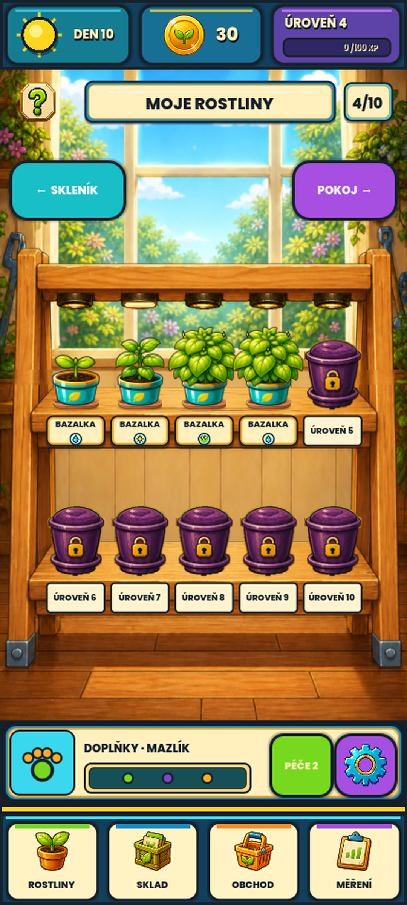

# Phase171 — přemalovaný stojan a skutečné dosednutí květináčů

## Zadání a hranice

Uživatel schválil keramickou podmisku Phase170, ale odmítl její usazení
vůči polici: celé rostliny působily, jako by stály nad stojanem. Výslovně
požádal o přemalování celého pěstitelského stojanu jako jednoho soudržného
kusu nábytku. Tato fáze mění **ROSTLINY**, nikoli sbírkový **POKOJ**.

Při zadání navazující Phase172 uživatel výslovně napsal „Souhlasím
s výsledkem“ a schválil zobrazený skutečný stojan Phase171. Toto přijetí
není schválením všech samostatných referencí dialogů a přechodových efektů.
Původní výsledky běhů níže se nemění. APK i Android audit zůstávají odložené.

```text
PHASE171_RACK=IMPLEMENTED_SOURCE_ONLY
PHASE171_FOCUSED_TESTS=PASSED_41
PHASE171_GEOMETRY_MATRIX=PASSED_1340_LAYOUTS
PHASE171_LABEL_MATRIX=PASSED_280_CASES
PHASE171_GPU_CAPTURE=PASSED_8_FRAMES
PHASE171_INTERNAL_VISUAL_REVIEW=COMPLETED_DESKTOP
PHASE171_REGRESSION=PASSED_6652
PHASE171_FULL_VALIDATION=FAILED_6_OF_34_VISUAL_GATES
PHASE171_QUICK=PASSED
PHASE171_USER_VISUAL_ACCEPTANCE=APPROVED_BY_USER
PHASE171_REFERENCE_TRANSITION=NOT_APPLIED_SEPARATE_OVERLAY_APPROVAL_REQUIRED
PHASE171_ANDROID_ACCEPTANCE=NOT_RUN_APK_DEFERRED_BY_USER
```

## Co bylo špatně a co se změnilo

- Stará horní deska pokračovala za dosednutím podmisky ještě přibližně
  66 zdrojových pixelů směrem k hráči, dolní asi 85. Otevřené a zamčené
  nádoby navíc používaly rozdílné dolní kotvy. Samotné správné spojení
  květináče s podmiskou tento prostorový dojem neopravilo.
- Nový stojan má společnou malbu dřeva, navazující sloupky, mělké horní
  plochy polic a zřetelná čela. Původní pozadí se nepřepsalo.
- `rack_stand_layout.gd` je jediným zdrojem konstrukčního mapování.
  Podmiska dosedá **11 pixelů za přední hranou směrem k zadní části police**
  v souřadnicích nové malby. Stejnou linii používá i skutečný alfa
  kontakt fialového zamčeného květináče, ne jeho průhledný okraj.
- Obě řady zachovávají pět pozic; společné čelní štítky se řídí deskou,
  nikoli rozměrem rostliny. Stavové ikony jsou menší a uvnitř štítků,
  takže nezakrývají kontakt podmisek se dřevem. Tvar ikon je původní.
- Názvy se měří přes skutečnou šířku, výšku a ascent fontu. Dlouhá
  MAJORÁNKA se neořezává, text ani stavová ikona nepřesahují štítek.
- Původní malovaná svítidla zůstávají samostatná a stejná. Nové pozadí
  neobsahuje zapečené lampy, a proto bylo odstraněno staré překrytí
  lamp kopírovaným pruhem dřeva.
- Všech 67 původních rostlinných PNG, Phase170 podmiska a její měření,
  Phase163 svítidlo i zamčený květináč zůstávají byte-exact.
  Detail rostliny, Pokoj, HUD, navigace, ekonomika a save se nemění.

## Konstrukce jediné malby

Produkční PNG má **992 × 1586** pixelů. Generátor nedodržel požadované
výškové souřadnice polic přesně; třetí pokus o jejich posun není použit.
Runtime proto zobrazuje jednu malbu v pěti **spojitě navazujících pásmech**:
horní police včetně zadní hrany a celého čela se posune jako celek o
70 zdrojových pixelů výše. Pouze sousední úseky stěny a sloupků změní
výšku; dolní police zůstává celá. Žádné pruhy se nekopírují přes sebe,
nevzniká mezera ani přelepení desky jinou texturou.

| Zdrojové Y | Konstrukční Y | Význam |
| --- | --- | --- |
| 0–730 | 0–730 | Horní okolí a příčník |
| 730–840 | 730–770 | Kratší stěna nad horní deskou |
| 840–995 | 770–925 | Celá horní police, pouze posun |
| 995–1150 | 925–1150 | Vyšší prostor pod horní policí |
| 1150–1586 | 1150–1586 | Celá dolní police a podlaha |

Zadní/přední hrany mají v surové malbě Y 846/909 a 1153/1245,
spodky čel Y 992 a 1330. Zdrojové PNG se kvůli mapování neupravovalo.
Test nezávisle ověřuje konkrétní pixely desek, souvislost všech pásů,
skutečné alfa siluety a prostor pod lampami v obou poměrech displeje.

## Skutečné snímky hry

Níže není nový generovaný mockup, ale uložený GPU render Godotu:



Další důkazy:

- [Po sklizni — rostliny zmizí, keramika zůstane správně na polici](visual-proposals/phase171/phase171-rack-post-harvest.png).
- [Plný stojan, běžný poměr](visual-proposals/phase171/phase171-rack-native-normal-fixture-0.png).
- [Plný stojan, kratší poměr](visual-proposals/phase171/phase171-rack-native-compact-fixture-0.png).
- [Prázdné, mladé, nemocné a mrtvé rostliny](visual-proposals/phase171/phase171-rack-native-compact-fixture-1.png).
- [Levandule a tymián v různých stavech](visual-proposals/phase171/phase171-rack-native-compact-fixture-2.png).

Všech osm obrazů je beze změny zkopírováno z
`.godot/phase171-rack-final/`. Plný HUD má 1080 × 2400 px;
samostatný stojan je testovaný při logických 432 × 780 a 360 × 620.
Hlavní agent prohlédl všech osm skutečných renderů.

## Ověření a ochrana práce

Cílený běh v `.godot/phase171-rack-final/focused.log`:
native exit 0, `PHASE171_TESTS_PASSED=41`.
Zahrnuje 12 nových agregovaných kontrol, 1 340 kombinací
67 zdrojových siluet × 10 pozic × 2 rozměry, 280 kontrol textu
a 40 kontrol smíšených/zamčených řad.

GPU capture: native exit 0, `PHASE171_RACK_CAPTURE=PASSED`,
`HOW_TO_GROW_CAPTURE=PASSED`, prázdný `capture-error.log`.
Použit byl OpenGL compatibility renderer, nikoli headless obraz.
První cílený běh zachytil chybný předpoklad rozměru nového PNG
991 × 1587; runtime a nezávislé testy byly opraveny podle skutečných
992 × 1586. Finální běh již prošel. Headless testy čtoucí PNG pro
nezávislé alfa měření emitují očekávané exportní warningy;
produkční runtime takové měření ani čtení obrázků z disku neprovádí.

Úplná validace: `.godot/validation/20260828-204526Z/`.
Regrese má `MVP_TESTS_PASSED=6652`; import a GPU capture prošly,
ale celek skončil native exit 1 a `HOW_TO_GROW_VISUALS=FAILED`:
**28 z 34 aktivních obrazových bran PASS, 6 FAILED**. Neprošly:

| Brána | RMSE | Podíl změněných pixelů |
| --- | ---: | ---: |
| guide-explain | 6,529 | 12,720 % |
| guide-celebrate | 6,041 | 11,288 % |
| guide-warning | 6,303 | 12,124 % |
| phase163-feedback-unlock-runtime-approved | 54,217 | 58,074 % |
| phase163-screen-transition-runtime-approved | 50,635 | 56,396 % |
| phase163-rack-runtime-approved | 47,875 | 48,154 % |

Všech šest porovnání a heatmap hlavní agent prohlédl: ukazují novou
malbu a usazení stojanu pod původními dialogy/efekty. Tyto brány dosud
porovnávají staré reference. Bez schválení nové celé kompozice zůstávají
FAILED; nepřepínají se na report-only ani se nerozšiřují tolerance.
Proti předchozímu skutečnému Phase170 běhu je **135/191 snímků
byte-exact**, 56 se liší a žádný nechybí. Všechny ostatní aktivní
obrazové brány zůstaly PASS.

Quick `.godot/automation/20260828-205331Z/`: native exit 0,
VisualContract a Regression PASS, `HOW_TO_GROW_AUTOMATION=PASSED`.
Je to technický PASS Quick režimu, nikoli přijetí nového vzhledu,
úplný obrazový PASS nebo fyzické mobilní ověření.

Předem chráněných 103 souborů je hashově beze změny. Stejně ověřena
Phase170 podmiska, její manifest a kanonický validační capture.
Reference, masky ani limity nebyly přepsány. Existující změny Phase166–170
jsou zachované; žádný commit, cleanup, export nebo instalace neproběhly.
Runtime stále `0.68.0-rc58`, Android code 75, save schema 41.
Immutable RC58 zůstává se SHA256
`0A7F173D8C97B552168A407C31F1F8AE85109A34C2F6F4786029551064F0C6F5`.

## Původ assetu a reprodukce malby

Nová produkce:
`assets/ui/visual/phase171/rack/rack_stand_painted_phase171_v1.png`.
SHA256:
`00F8CF9A50E8EA23BAAC629A64F7B0AF79BA1EEAB3F5F46FCA7A9A99681B698C`.
Lossless import, mipmapy, lineární filtrování; žádný dodatečný bitmapový
překreslovací skript. Explicitní profil `rack_stand_phase171` je svázán
se schváleným malovaným stylem a geometrickým kontraktem.

Použit vestavěný **imagegen** v režimu editace podle původního
`assets/backgrounds/comic_room_rack_v1.png`.
První výstup `exec-6d209543-35b8-4497-b36e-17bf004d8ca4.png`
byl dále upraven druhým promptem. Produkční druhý výstup byl
zkopírován beze změny z:

`C:/Users/drikv/.codex/generated_images/019ff205-6305-74c1-82b8-7c71e77613d0/exec-d67c086c-3f35-48dc-9457-2d75c040c105.png`

Třetí výstup `exec-761b9d9d-20f0-410f-9edc-6157fd1b13fd.png`
není použit. Schválení se nyní vyžaduje pro skutečný runtime výše,
nikoli pro některou meziverzi generované malby.

První prompt:

```text
Use case: precise-object-edit.
Asset type: production background painting for an existing portrait 2D gardening game; not a mockup.
Input image 1 is the edit target and style/lighting anchor: the empty wooden rack and sunny room. Repaint the ENTIRE CENTRAL WOODEN TWO-SHELF RACK as one cohesive beautiful physically believable piece of furniture. Preserve the original rich hand-painted cartoon game style, sunny upper-left lighting, warm honey oak, botanical green surroundings, original window framing, side potted plants and floor. Not photorealistic, not pixel art, not a plastic 3D render.
Critical geometry: front-facing symmetric rack, sturdy joined uprights, two LEVEL horizontal growing shelves, shallow visible top surfaces, thick solid front fascia for game labels, realistic joined timber and softly rounded edges. No floating or disconnected boards. The window/background remains visible through the rack. On the input's 887x1420 coordinate grid, aim for: upper empty shelf top plane from y674 to730, front fascia y730..812; lower empty shelf top plane y984..1040, front fascia y1040..1122. Shelf usable span x90..800, five future pots will stand in one straight row at x165,305,445,585,725 on each shelf. Keep the surfaces near frontal/slightly looking down, not steep top-down tabletops. Keep the top structural crossbeam near y420..475 and feet around y1280. Lower shelf clearance must comfortably fit the same height plants as upper shelf. Crisp warm front lip, gentle real wood grain following the boards, dark soft ambient shadows only at joints, shelf undersides and feet; no huge dark decorative outlines.
IMPORTANT: paint both shelves COMPLETELY EMPTY and clean with uninterrupted wood grain: NO plants, NO pots, NO saucers, NO painted circles for placement, NO labels, NO text, NO icons, NO locks, NO UI. These are drawn dynamically by the game. REMOVE ALL TEN EXISTING BAKED ELECTRIC LAMP FIXTURES from the old image: clean wooden underside on top crossbeam and upper shelf, NO hanging lamps or cables or sockets; existing approved brass lamp sprites will be added by the game later. Do not add a third growing shelf. Keep surrounding room recognizable with same camera, no new furniture or objects. Single polished portrait background, exact original framing/aspect 887:1420, high resolution ideally 1774x2840.
```

Produkční upřesnění s první malbou jako referencí (souřadnice jsou
zadání generátoru, nikoli tvrzení o přesném výsledku):

```text
Use case: precise-object-edit. This is a final gardening-game background asset. Refine ONLY the depth/perspective of the TWO empty wooden shelf top surfaces. Keep the beautiful current painted wood, cohesive rack, all front edges and fascia positions, posts, top crossbeam, window, plants at the outer edges, floor, lighting, colors and framing unchanged. The tops are still too deep/steeply viewed. Make them SHALLOW like practical plant shelves viewed almost from the front: on this 991x1587 image the upper shelf BACK edge should be around y835 and its FRONT upper edge must STAY at y890 (about55px visible depth); the lower shelf BACK edge around y1185 and FRONT upper edge STAY at y1245 (about60px visible depth). Extend the wall/background cleanly into the removed back portions, keep support joinery plausible. Do not move the front faces down or up. The clean straight front lips should be clearly visible, the top surfaces must join them without a gap. Front fascia remains broad enough for later interactive game labels. Same warm hand-painted cartoon, not photorealism, no stylistic change. No pots, no saucers, no central plants, no labels, no UI, no lamps, no circles, no decorations. Single portrait production asset, same exact camera/framing and aspect, no collage.
```
