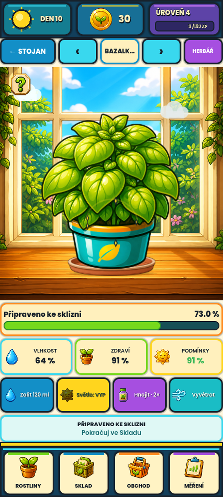

# Phase172 — detail rostliny pevně na parapetu

## Rozsah a stav

Uživatel schválil nový stojan Phase171, ale našel starou tyrkysovou misku
a chybné dosednutí v detailu otevřeném kliknutím na rostlinu. Oprava mění
jen kreslení detailu a jeho testy. Schválený stojan, Pokoj, původní PNG,
ekonomika, save, immutable RC58 i APK v telefonu zůstávají beze změny.

```text
PHASE172_IMPLEMENTATION=IMPLEMENTED_SOURCE_ONLY
PHASE172_FOCUSED_TESTS=PASSED_84
PHASE172_GEOMETRY_MATRIX=PASSED_3752_FRAME_COMBINATIONS
PHASE172_GPU_CAPTURE=PASSED_12_FRAMES
PHASE172_REGRESSION=PASSED_6662
PHASE172_QUICK=PASSED
PHASE172_FULL_VALIDATION=FAILED_10_OF_34_VISUAL_GATES
PHASE172_INTERNAL_VISUAL_REVIEW=COMPLETED_DESKTOP
PHASE172_USER_VISUAL_ACCEPTANCE=PENDING_USER_REVIEW
PHASE172_ANDROID_ACCEPTANCE=NOT_RUN_APK_DEFERRED_BY_USER
PHASE172_REFERENCE_CHANGES=NONE
```

## Příčina a oprava

- Detail měl vlastní tyrkysovou podmisku sestavenou z oválů, ač stojan
  již používal schválenou malovanou terakotu Phase170.
- Květináč se kotvil k `size.y - 3`, tedy ke spodnímu okraji celé kresby,
  nikoli k horní ploše parapetu. Původní animace navíc posouvala,
  otáčela a měnila velikost celého květináče vůči statické podmisce.
- Nový `plant_detail_layout.gd` používá původní pozadí 887 × 1024:
  horní plocha je mezi zdrojovým Y798 a Y928. Kontakt je Y917, tedy
  11 zdrojových pixelů za přední hranou. Parametry potvrzují nezávislé
  barevné sondy na skutečné malbě, nikoli jen porovnání stejných konstant.
- Detail i stojan sdílejí **tentýž PNG soubor podmisky**, výřez
  `[56,98,2062,528]` a měřený alfa kontakt všech 67 původních textur.
  Šířka podmisky je 1,24× šířka základny květináče, dosednutí na 70 %
  její výšky. Žádný nově generovaný obrázek ani úprava zdrojových PNG.
- Měřítko zůstává izotropní. U kratšího detailu se sestava rovnoměrně
  přizpůsobí tak, aby se vešel celý canvas rostliny i celá podmiska
  na horní plochu parapetu. Kontakt a měřítko se nemění během animací.
- Zálivka, růstové jiskry, beruška, vítr a signalizace vlastností zůstaly;
  odstraněn je pouze pohyb celého květináče. Prázdný květináč má vlastní
  správnou texturu. Čtyři posklizňové stavy se nadále kreslí odděleně,
  bez původní rostliny a podmisky; balení stojí na stejné linii parapetu.
- Geometrie nepoužívá za běhu GPU readback ani měření pixelů;
  sdílená metadata se načtou jednou a znovu používají.

## Automatická prevence opakování

`tests/plant_detail_grounding_test.gd` je zapojen do výchozí kompletní
sady i cíleného `--phase172-only`. Obsahuje 10 agregovaných kontrol:

- 67 PNG × 7 rozměrů × 8 animačních profilů = **3 752 kombinací**.
- Nezávislé měření skutečné alfa siluety včetně antialiasovaných pixelů,
  kontrola celého canvasu, rovnoměrného měřítka a kontaktu keramiky.
- Celá podmiska musí být uvnitř horní plochy parapetu, ne pod jeho čelem.
- 77 EMPTY, 154 wilt/DEAD a 308 posklizňových případů; kontrola,
  že renderování ani měření nemění uložitelný herní stav.
- Původní PNG, schválená Phase170 podmiska a Phase171 malba mají pevné
  kontrolní hashe. Test skutečné kreslicí cesty zakazuje starý ovál
  a následný transform celého květináče.

Rozměry matice: 432×451, 432×365, 500×361, 410×363, 404×375,
360×300 a historický izolovaný test 432×445. Běžný 432×451 a kompaktní
360×300 jsou změřené také v opravdovém rozložení hlavní scény na GPU.
Ostatní jsou samostatně testované geometrické/safe-area varianty.

Automatické kontroly zachytí konkrétní chyby kontaktu a ořezu; nejsou
zárukou, že je každý výtvarný detail celé hry perfektní nebo schválený.

## Skutečné snímky Godotu



- [Kratší displej](visual-proposals/phase172/phase172-detail-compact.png)
- [Zálivka](visual-proposals/phase172/phase172-detail-water.png),
  [růst](visual-proposals/phase172/phase172-detail-growth.png),
  [beruška](visual-proposals/phase172/phase172-detail-ladybug.png)
- [Prázdný květináč](visual-proposals/phase172/phase172-detail-compact-empty.png),
  [klíčení levandule](visual-proposals/phase172/phase172-detail-compact-lavender-seed.png),
  [mladá levandule](visual-proposals/phase172/phase172-detail-compact-lavender-young.png)
- [Dospělá šalvěj](visual-proposals/phase172/phase172-detail-compact-sage-mature.png),
  [uhynulá bazalka](visual-proposals/phase172/phase172-detail-compact-basil-dead.png)
- [Sušení](visual-proposals/phase172/phase172-detail-compact-drying.png),
  [balení](visual-proposals/phase172/phase172-detail-compact-packaged.png)

Všech 12 PNG je beze změny zkopírováno z `.godot/phase172-detail-final/`.
Jde o desktopový render 1080×2400 s testovacími daty, ne o snímek telefonu.
Nový `tools/capture_phase172_detail.gd` ověřuje otevření detailu přes
skutečný handler a signál stojanu; nejde o fyzický dotyk na Androidu.
Přebírá deterministická data, ale obnovuje produkční hlavičku s Herbářem
a ořezáváním dlouhého názvu. Čeká na dokončení 0,18s vstupního prolínání.
Historický kanonický capture a jeho záměrně stará hlavička se nemění.

## Výsledky úplného ověření

- `.godot/phase172-focused-v1/`: exit 0, `PHASE172_TESTS_PASSED=84`.
- `.godot/validation/20260828-220639Z/`: import a
  `MVP_TESTS_PASSED=6662`, capture PASS, ale vizuální porovnání exit 1:
  **24/34 tvrdých bran PASS, 10 FAILED**, 20 neblokujících reportů.
- `.godot/automation/20260828-221540Z/`: Quick exit 0,
  VisualContract + Regression PASS, `HOW_TO_GROW_AUTOMATION=PASSED`.
  Quick nezahrnuje splnění všech obrazových bran.

Všech deset neprošlých třípanelových porovnání a heatmap bylo prohlédnuto:

| Brána | MAE | RMSE | Změněné pixely |
| --- | ---: | ---: | ---: |
| detail-realtime | 14,106 | 44,026 | 17,402 % |
| feedback-water | 14,078 | 43,980 | 17,395 % |
| feedback-growth | 13,978 | 43,795 | 17,341 % |
| phase151-detail-runtime-approved | 14,739 | 44,997 | 17,806 % |
| guide-explain | 2,632 | 6,529 | 12,720 % |
| guide-celebrate | 2,360 | 6,041 | 11,288 % |
| guide-warning | 2,516 | 6,303 | 12,124 % |
| phase163-feedback-unlock-runtime-approved | 29,855 | 54,217 | 58,074 % |
| phase163-screen-transition-runtime-approved | 27,652 | 50,635 | 56,396 % |
| phase163-rack-runtime-approved | 24,290 | 47,875 | 48,154 % |

Nezměněné limity: MAE≤4, RMSE≤12, změněný podíl≤6 % při pixelové
toleranci 12. U tří dialogů selhává pouze podíl, u ostatních všechny
tři metriky. Čtyři detailové brány ukazují opravované posunutí rostliny
na parapet a výměnu podmisky; zbývajících šest odchylek pochází již
z Phase171 stojanu. Kontrolní snímky těchto šesti případů jsou proti
předchozímu Phase171 běhu byte-exact. Nové schválení detailu teprve čeká.

Tento běh zachoval **161/191** předchozích PNG byte-exact, žádné nechybí.
Mezi zbývajícími diagnostickými rozdíly jsou změny detailu a nestabilní
animační mezisnímky obchodníka, XP a odemykání; ty nejsou novým zásahem
do jejich runtime. Nesmějí se zaměňovat za 30 nových hotových úprav.

Schválení hlavního stojanu Phase171 je zaznamenané. Převod všech šesti
dialogových/efektových referencí na nový baseline nebyl autorizován,
nebyl proveden a není nutný k implementaci opravy detailu. Žádné reference,
jejich mapování, masky nebo tolerance se v této fázi nezměnily.

## Zachování a omezení

110 předem zaznamenaných chráněných souborů má stejné SHA256, včetně
všech původních rostlinných PNG, pozadí, schváleného stojanu, jeho runtime,
podmisky, manifestu vizuálních bran, kanonického capture a immutable APK.
RC58 má nadále SHA256
`0A7F173D8C97B552168A407C31F1F8AE85109A34C2F6F4786029551064F0C6F5`.
Žádný cleanup, reset, commit, změna hráčských dat, publikování ani APK.

Testy při čtení zdrojových PNG vypisují Godot varování `Image.load_from_file`
o exportu; jde pouze o zdrojové měření v testech, nikoli runtime readback.
Závěrečný samostatný GPU capture nemá stderr. První pokus o nový capture
skončil běžnou chybou inferovaného typu, nikoli nativním pádem; další
iterace opravily také přípravu snímků. Neúspěšné pokusy zůstaly zachované
a nejsou vydávané za finální náhled.
