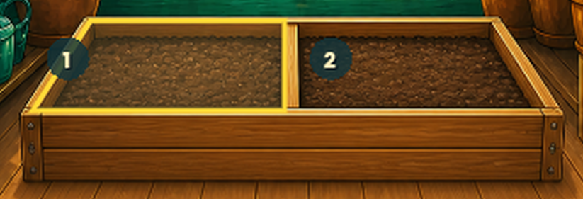
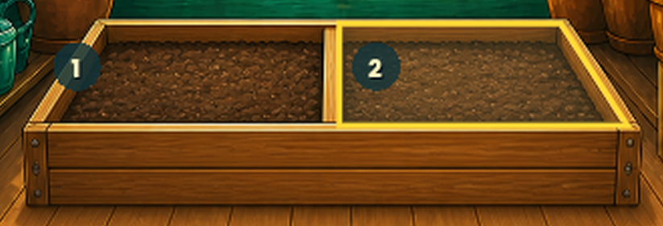

# Phase174 — zarovnání dvou zadních obrysů Skleníku

## Změna

Pouze žluté zvýraznění zadních polí 1 a 2 má novou geometrii, změřenou
podle dřevěného lemu původního PNG 887 × 1774. Původní horní hrany byly
příliš široké a ležely níže než namalovaný zadní okraj truhlíku.

Výplň výběru i její obrys sdílí stejný perspektivní čtyřúhelník.
Obrys se mapuje stejným cover převodem jako pozadí, ne pevným posunem
v pixelech displeje. Přední pole 3 a 4 používají přesně původní geometrii.

Žádná změna malby, plodin, čísel, stavových značek, dotykových ploch,
ekonomiky ani ostatních obrazovek. APK je nadále odložené.

## Skutečné výřezy z Godotu

Jde o dva samostatné stavy skutečné hry: zvýrazněné je vždy jedno pole.
Nejde o nový obrázek pozadí ani ručně upravený screenshot.

## Ověření

- `.godot/phase174-focused`: `PHASE174_TESTS_PASSED=16`, exit 0.
- Souřadnice ověřené nezávislým výpočtem pro pět velikostí obsahu.
- `.godot/phase174-before` a `.godot/phase174-after`: každý deset GPU
  snímků, exit 0, po opravě stderr prázdný.
- Automatické kliknutí přes Godot GUI vybralo všechna čtyři pole
  na displejích 432 × 960 i 360 × 800. Cíle stále mají alespoň 64 × 64.
- Všechny čtyři celé snímky s vybranými předními poli jsou před/po
  pixelově totožné. Při výběru zadních polí se mění pouze jejich zvýraznění.
- Rozdílové bbox v PNG 1080 × 2400: normální pole 1 `[146,921,540,1080]`,
  normální pole 2 `[539,921,932,1080]`, kompaktní pole 1 `[145,914,540,1072]`,
  kompaktní pole 2 `[536,914,934,1072]`.

Úplná validace `.godot/validation/20260829-000147Z`: import a GPU capture
PASS, `MVP_TESTS_PASSED=6676`, **24/34 obrazových bran PASS**, celkový
exit **1 / FAILED**. Nevydává se za úplné vizuální přijetí.

Všech deset neprošlých porovnání i jejich metriky je byte-exact shodných
s již prohlédnutým během Phase173 `.godot/validation/20260828-232653Z`.
[Přesná tabulka metrik, překročené limity a příčiny](PHASE173_DETAIL_HEADER_EDGES.md#ověření)
zůstává platná: šest dřívějších rozdílů stojanu a čtyři detailu rostliny.
Tato oprava Skleníku nepřidala žádnou novou neprošlou bránu.
Skleník proti konceptu Phase150 zůstává report-only, nikoli nově schválený gate.

Všech 54 referenčních případů má stejné vstupní SHA256 jako před opravou.
109 dříve chráněných souborů je nezměněných; zvlášť ověřený `main.gd`,
detail rostliny, opravená horní lišta a společné mapování kamery také.

`PHASE174_USER_VISUAL_ACCEPTANCE=PENDING_USER_REVIEW`.
`PHASE174_ANDROID_ACCEPTANCE=NOT_RUN_APK_DEFERRED_BY_USER`.

Původní PNG Skleníku zůstává SHA256
`1CD27B4F32B1C7039FDD3CF2CC8903963F01D44A77DBD223BAC85EDE06DF9321`.
Reference, masky, tolerance, immutable RC58 a předchozí práce se nepřepisují.
