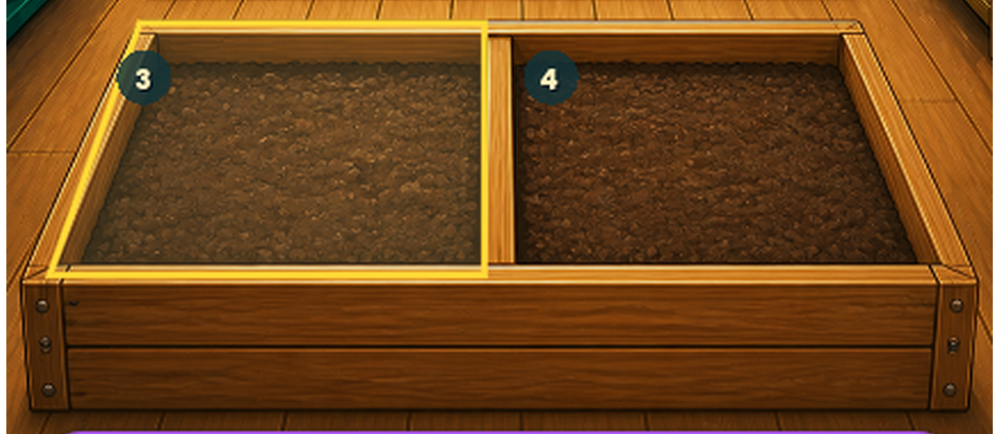
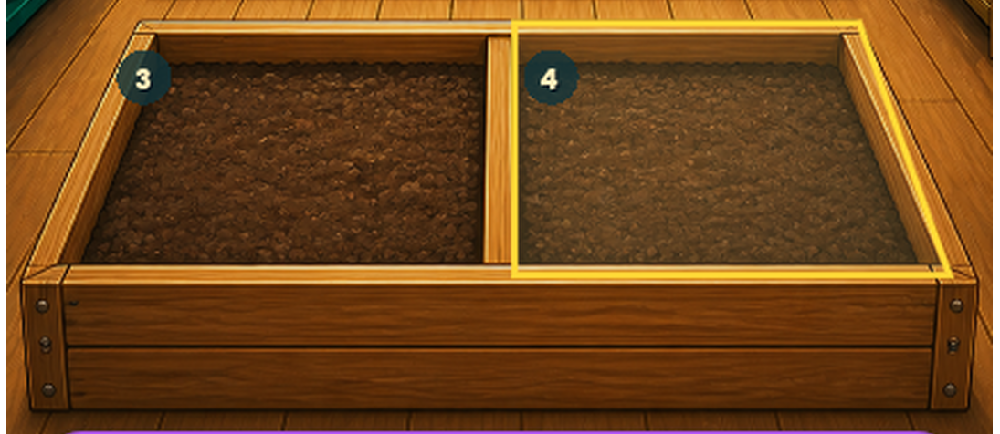

# Phase176 — zarovnání předních výběrů ve Skleníku

## Oprava

Žluté zvýraznění záhonů 3 a 4 už nepoužívá starý polygon hlíny. Oba
obrysy mají vlastní zrcadlově symetrickou geometrii změřenou přímo podle
perspektivy velkého předního dřevěného truhlíku:

- levý: `(120,930) → (430,930) → (430,1157) → (39,1157)`;
- pravý: `(457,930) → (767,930) → (848,1157) → (457,1157)`.

Horní linka tak leží na malované zadní hraně rámu místo o 20 zdrojových
pixelů níže v hlíně. Vnější spodní rohy jsou současně zasunuté o 14 pixelů,
aby šikmé strany procházely středem dřevěných lemů.

Polygony hlíny, plodiny, jejich baseline, stavové karty, dotykové obdélníky,
ekonomika, save i původní PNG se nemění. Zadní oprava Phase174 zůstává
beze změny.

## Skutečný Godot render

Capture používá skutečné kliknutí přes Godot GUI. `.godot/phase176-before`
a `.godot/phase176-after` obsahují vždy osm celých snímků pro 432 × 960 a
360 × 800 a dva pevné výřezy předního truhlíku.

- záhony 1 a 2 jsou před/po pixelově totožné v obou rozloženích;
- záhon 3 mění 28 309 pixelů běžného a 29 954 pixelů kompaktního snímku;
- záhon 4 mění 28 341 pixelů běžného a 30 015 pixelů kompaktního snímku;
- bounding box každé změny zůstává pouze uvnitř příslušné přední poloviny.

## Ověření

- cíleně `.godot/phase176-focused`: `PHASE176_TESTS_PASSED=17`, exit 0;
- všech pět responzivních mapování, 64px dotykové minimum, odstup stavové
  karty a nezměněné crop/soil baseline PASS;
- GPU `.godot/phase176-after`: `PHASE176_GREENHOUSE_GUI_INPUT=PASSED`,
  `PHASE176_GREENHOUSE_CAPTURE=PASSED`, exit 0;
- úplná validace `.godot/validation/20260829-014854Z`:
  `MVP_TESTS_PASSED=6702`, capture PASS;
- závěrečná Quick `.godot/automation/20260829-015512Z`: VisualContract,
  Regression a technická brána PASS, `HOW_TO_GROW_AUTOMATION=PASSED`.

Celková obrazová validace zůstává **FAILED, 24/34 aktivních bran PASS**.
Jde o přesně stejných deset dříve známých porovnání stojanu, detailu,
průvodce a efektů jako v Phase175; jejich názvy i metriky jsou řádek po
řádku shodné a všechny comparison snímky byly znovu prohlédnuté. Oprava
Skleníku nepřidala novou neprošlou bránu. Reference, masky ani tolerance
se neměnily.

`PHASE176_LOCAL_TECHNICAL_FRONT_SELECTION=PASSED`.
`PHASE176_USER_VISUAL_ACCEPTANCE=PENDING_USER_REVIEW`.
`PHASE176_ANDROID_ACCEPTANCE=NOT_RUN_APK_DEFERRED_BY_USER`.

Původní malba Skleníku zůstává byte-exact se SHA-256
`1CD27B4F32B1C7039FDD3CF2CC8903963F01D44A77DBD223BAC85EDE06DF9321`.
Immutable RC58 i APK zůstávají beze změny.
