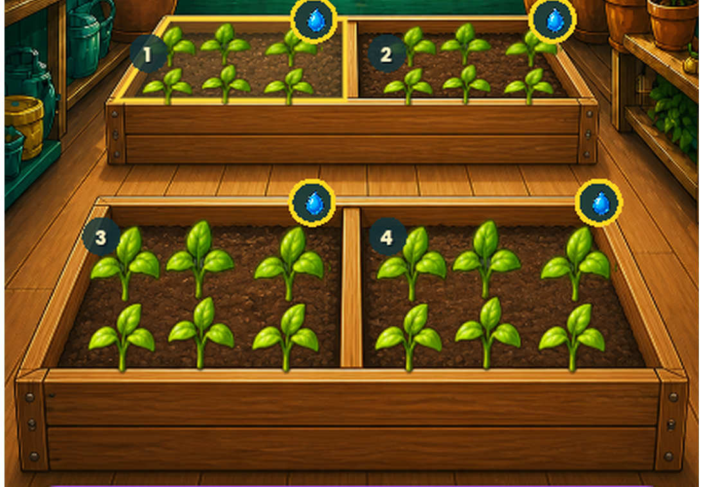
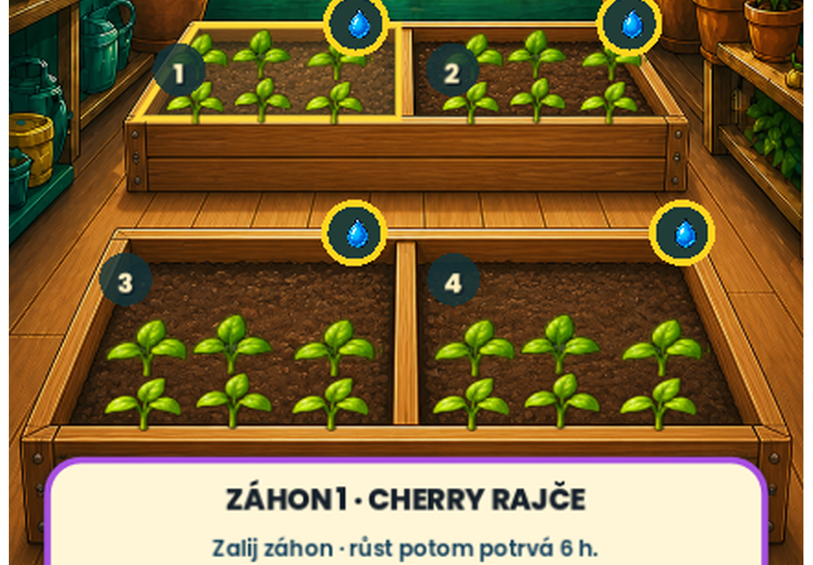

# Phase177 — sazenice uvnitř skleníkových truhlíků

## Nález a oprava

Šest malých sazenic používalo správnou velikost i společnou půdní baseline,
ale jejich vodorovný střed se odvozoval z obdélníkových crop bounds. U
silně perspektivního předního truhlíku tím levá polovina mířila o `29,5`
zdrojového pixelu doleva a pravá o `29,5` pixelu doprava. Krajní listy proto
zasahovaly přes šikmé dřevěné boky.

Runtime nyní používá skutečné perspektivní středy čtyř záhonů ve zdrojovém
prostoru 887 × 1774:

`[290,0; 597,0; 260,5; 626,5]`.

Změna se aplikuje jen na roli `seedlings`. Nemění jejich velikost, šest kusů
ve třech sloupcích, svislé ukotvení ani zdrojovou malbu. Zadní středy už byly
správné, takže jejich výsledný render zůstává pixelově totožný. Dospělé
plodiny dál používají původní širší kompozici; soil polygony, dotykové cíle a
schválené Phase176 obrysy se nemění.

## Skutečný Godot render

Deterministický real-render capture založí bez zálivky cherry rajče ve všech
čtyřech záhonech, takže současně ukáže stejný stav `needs_water` a stejných
šest sazenic v každé polovině.

- audit původní geometrie našel mimo přední Phase176 rám `248 / 513`
  nenulových alfa vzorků (`164 / 252` při alfa alespoň 128);
- po přecentrování je výsledek `0 / 0` vně rámu;
- běžný capture mění jen bbox `(91,331)–(1002,588)` přední části výřezu;
- kompaktní capture mění jen bbox `(97,418)–(1007,591)` přední části;
- zadní část je před/po pixelově totožná v obou rozloženích.

## Ověření

- cíleně `.godot/phase177-focused-r3.log`:
  `PHASE177_TESTS_PASSED=26`, bez warningu nebo chyby;
- úplná alfa silueta je uvnitř obou předních rámů ve všech pěti
  podporovaných rozloženích;
- skutečný GPU capture `.godot/phase177-after-recenter`:
  `PHASE177_FOUR_SEEDLING_STATES=PASSED`,
  `PHASE177_GREENHOUSE_CAPTURE=PASSED` a
  `HOW_TO_GROW_CAPTURE=PASSED`;
- úplná validace `.godot/validation/20260829-065003Z`:
  `MVP_TESTS_PASSED=6711` a capture PASS;
- závěrečná Quick `.godot/automation/20260829-065831Z`: VisualContract,
  Regression a technická brána PASS, `HOW_TO_GROW_AUTOMATION=PASSED`;
- obrazová sada zůstává **FAILED, 24/34 aktivních bran PASS** kvůli přesně
  stejným deseti dříve známým porovnáním jako Phase176. Jejich názvy i
  metriky jsou shodné a všechny comparison snímky byly znovu prohlédnuté.
  Oprava sazenic nepřidala novou neprošlou bránu a reference, masky ani
  tolerance se neměnily.

Původní malba Skleníku zůstává byte-exact se SHA-256
`1CD27B4F32B1C7039FDD3CF2CC8903963F01D44A77DBD223BAC85EDE06DF9321`.
Runtime PNG sazenic zůstává byte-exact se SHA-256
`2CC73A225EC6FF20660A0ADAD1644C8EFCAC8AAB5828F7D011496C8BD1DE0411`.

`PHASE177_LOCAL_TECHNICAL_SEEDLING_CONTAINMENT=PASSED`.
`PHASE177_USER_VISUAL_ACCEPTANCE=PENDING_USER_REVIEW`.
`PHASE177_ANDROID_ACCEPTANCE=NOT_RUN_APK_DEFERRED_BY_USER`.

Save, ekonomika, verze, immutable RC58 i APK zůstávají beze změny.
