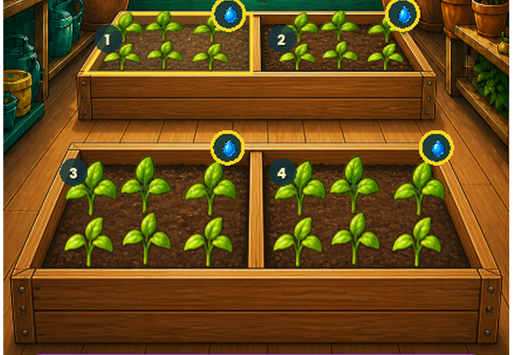
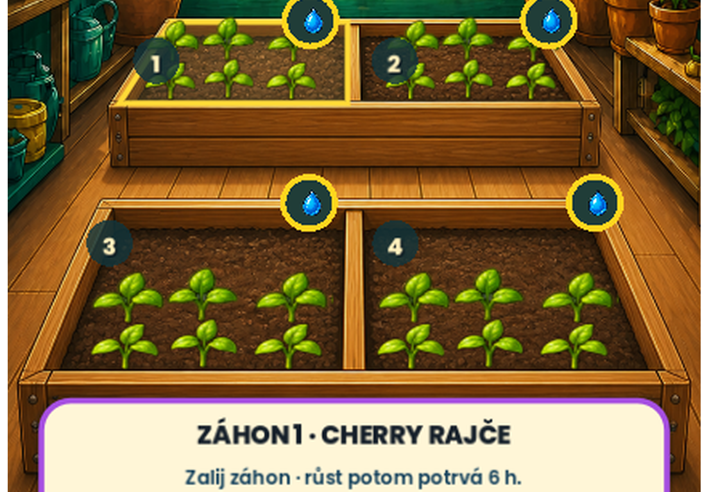

# Phase178 — sazenice zasazené v hlíně skleníkových záhonů

## Nález a oprava

Phase177 udržela všech šest sazenic uvnitř perspektivních boků každého
záhonu, jejich spodní konce ale stále dosedaly na horní hranu předního
dřeva. Rostliny proto místy působily, jako by stály na prkně místo v půdě.

Runtime nyní používá samostatnou seedling-only baseline ve zdrojovém
prostoru 887 × 1774:

`[802,0; 802,0; 1148,0; 1148,0]`.

Zadní sazenice se tím posunuly dozadu o `11` zdrojových pixelů, což na
skutečném 1080px výřezu odpovídá přibližně `13 px`. Přední sazenice se
posunuly o `7` zdrojových pixelů, přibližně `9 px` ve stejném výřezu.
Odlišná hodnota pro obě dvojice respektuje perspektivu: stonky končí v
hlíně, ale přední rostliny nejsou zbytečně utopené.

Změna se týká pouze svislého ukotvení role `seedlings`. Zachovává:

- perspektivní vodorovné středy z Phase177;
- velikost a počet sazenic;
- geometrii a ukotvení dospělých plodin;
- soil a selection polygony i dotykové cíle;
- původní malbu Skleníku a PNG sazenic.

## Skutečný Godot render

Deterministický real-render capture zakládá cherry rajče bez zálivky ve
všech čtyřech záhonech. Na jediném snímku proto ověřuje stejný stav
`needs_water`, všech šest sazenic v každé polovině a jejich kontakt s
hlínou v běžném i kompaktním rozložení.

## Ověření a stav přijetí

- cílená sada: `PHASE178_TESTS_PASSED=35`;
- skutečný GPU capture `.godot/phase178-final`:
  `PHASE178_FOUR_SEEDLING_STATES=PASSED`,
  `PHASE178_GREENHOUSE_CAPTURE=PASSED` a
  `HOW_TO_GROW_CAPTURE=PASSED`;
- úplná validace `.godot/validation/20260829-082238Z`: `MVP_TESTS_PASSED=6720`,
  capture PASS, ale celkově **FAILED** kvůli 24/34 aktivním obrazovým branám.
  Deset
  neprošlých bran má přesně stejné názvy i metriky jako Phase177 a všechna
  jejich comparison byla znovu prohlédnuta; dnešní Skleník nepřidal novou
  odchylku;
- Quick `.godot/automation/20260829-082945Z`: VisualContract PASS,
  Regression PASS, `AUTOMATION_TECHNICAL_GATE=PASSED` a
  `HOW_TO_GROW_AUTOMATION=PASSED`;
- `PHASE178_FULL_VALIDATION=FAILED_10_UNCHANGED_PREEXISTING_VISUAL_GATES`;
- `PHASE178_QUICK_AUTOMATION=PASSED`;
- `PHASE178_LOCAL_TECHNICAL_SEEDLING_DEPTH=PASSED`;
- `PHASE178_USER_VISUAL_ACCEPTANCE=PENDING_USER_REVIEW`;
- `PHASE178_ANDROID_ACCEPTANCE=NOT_RUN_APK_DEFERRED_BY_USER`.

Lokální technický PASS potvrzuje geometrii a skutečný render, nikoli lidské
vizuální schválení. Podle pokynu nebyla vytvořena, nahrazena ani instalována
žádná APK. Save, ekonomika, verze, immutable RC58, hráčská data i všechny
předchozí pracovní změny zůstávají beze změny.
