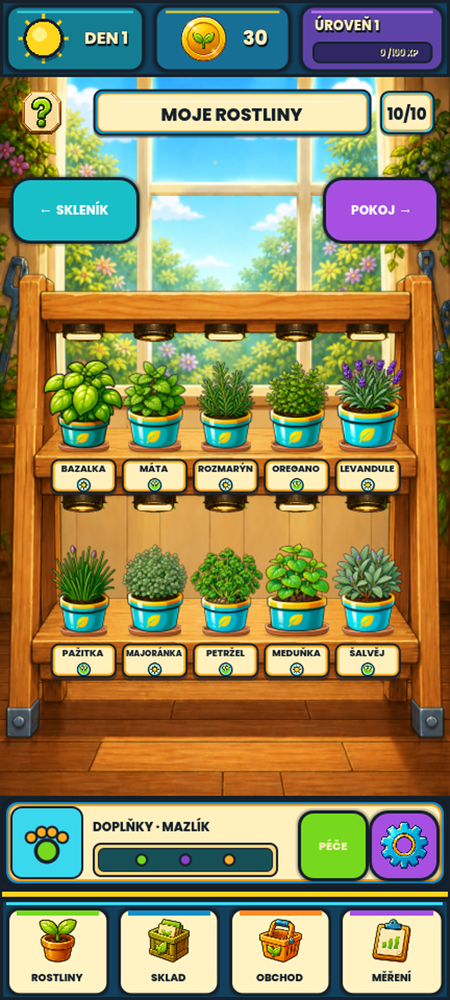

# Phase179 — samostatná živá světla na stojanu

## Výsledek

Každé z deseti skutečných mosazných světel ve stojanu `ROSTLINY` má vlastní
dotykový cíl. Krátké klepnutí rozsvítí nebo zhasne výhradně lampu nad daným
květináčem a mění skutečný stav `lamp_on` příslušné rostliny. Výběr rostliny
se tím nepřepíná a stav se ukládá přes stávající save schema 41.

Interakce je chráněná pro mobil:

- akce se potvrdí až po puštění na stejném svítidle;
- pohyb prstu nad `14 px` kliknutí zruší, takže vodorovný swipe neaktivuje
  lampu ani později neotevře detail rostliny;
- deset cílů je vzájemně oddělených, obsahuje celé malované svítidlo a na
  rozměrech 432 × 960 i 360 × 800 má nejméně `48 × 48 px`;
- prázdný, zamčený nebo již sklizený slot nic nezmění a dostane pouze krátkou
  oranžovou odezvu odmítnutí;
- více prstů si nerozbije rozpracované gesto jiného světla.

## Animace

Rozsvícení trvá `0,42 s`: čočka plynule zesílí, pod lampou se objeví jemný
teplý kužel a krátké malé paprsky. Zhasnutí je svižnější (`0,24 s`). Každý
index má vlastní přechodový stav, takže lze několik světel rozsvítit současně
a rychlé obrácení ON/OFF naváže z právě viditelného jasu bez skoku. Ustálené
světlo jen velmi jemně dýchá; volba `Méně pohybu` odstraní pulz i paprsky a
přechod rychle dokončí.

Schválený Phase163 obrázek mosazného svítidla se nemění ani nepřebarvuje.
Animace, světelný kužel a dotyková odezva jsou kreslené až za běhu kolem
byte-exaktně zachovaného PNG.

## Skutečný Godot render

Kompaktní rozložení je doložené ve
`visual-proposals/phase179/phase179-rack-lights-on-compact.png` a
`visual-proposals/phase179/phase179-rack-lights-transition-compact.png`.
Deterministický capture používá deset skutečných rostlin a zachycuje stav
všech světel vypnutých, střídavě zapnutých a pět souběžných animací přesně ve
42 % přechodu.

## Ověření a stav přijetí

- cílená sada: `PHASE179_TESTS_PASSED=21`;
- skutečný GPU capture
  `.godot/phase179-rack-lights/20260829-100948Z`:
  `PHASE179_INDEPENDENT_LIGHT_STATES=PASSED`,
  `PHASE179_CONCURRENT_LIGHT_ANIMATION=PASSED`,
  `PHASE179_RACK_LIGHTS_CAPTURE=PASSED` a `HOW_TO_GROW_CAPTURE=PASSED`;
- úplná validace `.godot/validation/20260829-101254Z`:
  `MVP_TESTS_PASSED=6733`, capture PASS, ale celek zůstává **FAILED** s
  **24/34 obrazovými branami PASS**. Neprošla stejná množina deseti starších
  porovnání jako v Phase178. Všech deset comparison bylo znovu prohlédnuto;
  jde o dřívější změny detailu, feedbacku, průvodce a stojanu vůči starým
  referencím, nikoli o novou chybu lamp;
- Quick `.godot/automation/20260829-102406Z`: VisualContract PASS,
  Regression PASS, `AUTOMATION_TECHNICAL_GATE=PASSED` a
  `HOW_TO_GROW_AUTOMATION=PASSED`;
- `PHASE179_LOCAL_TECHNICAL_RACK_LIGHTS=PASSED`;
- `PHASE179_FULL_VALIDATION=FAILED_10_UNCHANGED_PREEXISTING_VISUAL_GATES`;
- `PHASE179_QUICK_AUTOMATION=PASSED`;
- `PHASE179_USER_VISUAL_ACCEPTANCE=PENDING_USER_REVIEW`;
- `PHASE179_ANDROID_ACCEPTANCE=NOT_RUN_APK_DEFERRED_BY_USER`.

Technický PASS potvrzuje samostatné stavy, uložení, dotykovou bezpečnost,
animaci a skutečný render. Nenahrazuje lidské vizuální schválení. Podle
pokynu nebyla vytvořena ani instalována APK; immutable RC58, hráčská data,
ekonomika, verze i všechny předchozí pracovní změny zůstávají zachované.
